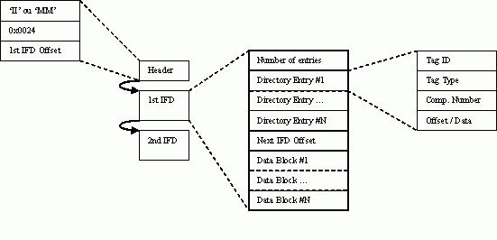
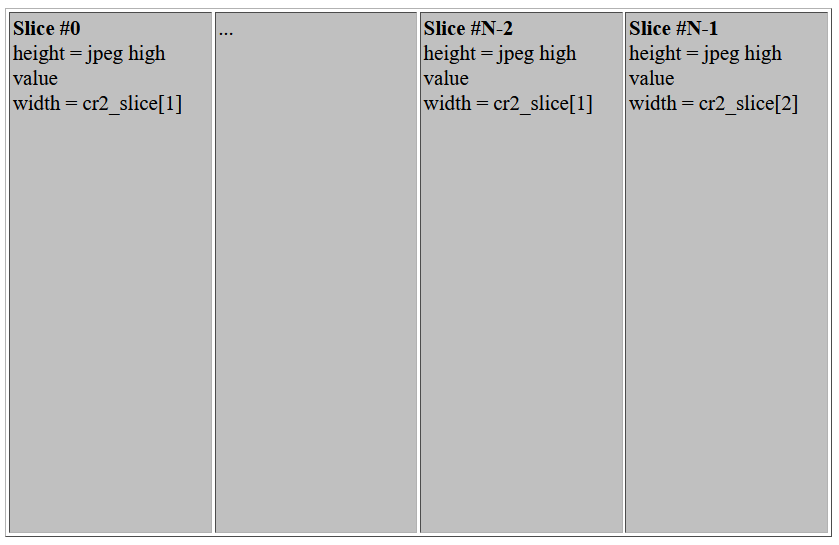
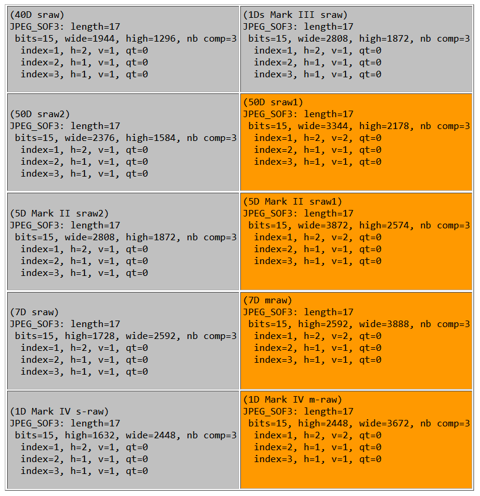
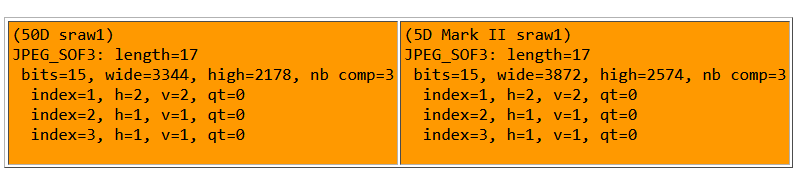
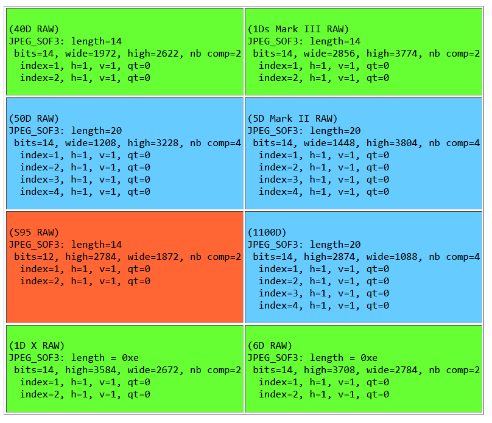
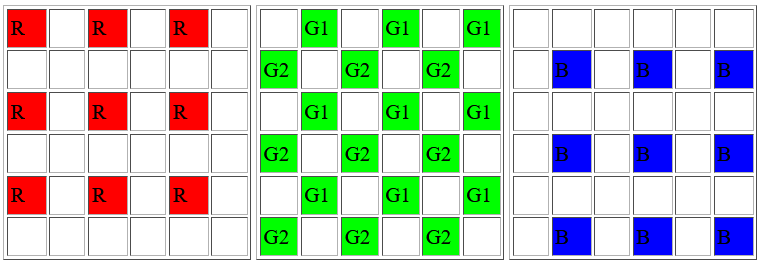

# Understanding What is stored in a Canon RAW .CR2 file, How and Why

### (.CR2 files are produced by Canon EOS Digital Cameras since 2004)

<a href="http://creativecommons.org/licenses/by-nc-sa/4.0/" rel="license"></a>  
This work is licensed under a <a href="http://creativecommons.org/licenses/by-nc-sa/4.0/" rel="license">Creative Commons Attribution-NonCommercial-ShareAlike 4.0 International License</a>.

Version 0.9 (September 26th, 2026)  
@lorenzo2472 on bluesky.  

This document is a work in progress, if you want to help, send me an email!

* **26sep2026: Conversion to markdown, [canon_cr2](https://github.com/lclevy/canon_cr2) on github**

* **31dec2018: Source code release for [libcraw2, craw2tool and PyCraw2](https://github.com/lclevy/libcraw2)**

* **12mar2018: Started to describe the Canon CR3 raw format [here](https://github.com/lclevy/canon_cr3)**

------------------------------------------------------------------------

[1. Introduction](#intro)  
[2. Find image and camera properties: parsing the CR2 file and keep some tags values](#parsing)  
[2.1 Overview](#tiff_over)  
[2.2 Key information to get (not exhaustive)](#key_info)  
2.3. TIFF and CR2 header  
2.4. IFD#0  
2.4.1. Exif subIFD  
2.4.2. Makernote subIFD  
[Tag 0x0083: Original Decision Data](#odd)  
[Tag 0x0097: Dust Delete Data](#ddd)  
2.5. IFD#1  
2.6. IFD#2  
2.7. IFD#3  
[3. Decode the lossless jpeg grayscale picture](#lossless)  
3.1. Introduction  
[3.2. SRaw encoding (not RGB!)](#sraw)  
3.2.1. Sraw and sraw2 encoding  
3.2.2. Sraw1 (mraw) encoding  
3.3. RAW encoding (not direct RGB!)  
3.4. Dual Pixel RAW  
3.5. JPEG decompression  
[4. Creating RGB picture from the grayscale CFA values](#interpol)  
[5. White Balance correction, Black subtraction and Color scaling](#wb)  
[6. Color space conversion and Gamma correction](#color)  
6.1 RGB to XYZ color space conversion  
6.2 XYZ to RGB conversion  
6.3 Gamma correction for 16bits-\>8bits conversion  
[7. References](#ref)  
[8. Patents](#soft)  
[9. Magic Lantern work](#ml)  
[10. Appendices](#app)

------------------------------------------------------------------------

#### Changelog

- 10may2017: added section about [Magic Lantern](http://www.magiclantern.fm/forum/index.php?board=6.0) firmware project, and Dual Pixel information from Anton Reiser  
- 18dec2016: updates for EOS M5 (thanks to [Danny Henriquez](https://www.flickr.com/photos/danny_henriquez/)),  
- sep2016: updates for 5D Mark IV raw/sraw/mraw/dpraw (thanks to [Christian Leibig](http://photos-by.me/)),  
- 03jul2016: updates for 1300D, G7X Mark II, 80D sraw/mraw (thanks to [Benny Urbina](https://portraitmoments.smugmug.com/)), 1DX Mark II (thanks to [Eldar Hauge](https://www.facebook.com/eldarhaugephotography)).  
- 19Mar2016: cr2_database and dng_info updated with G3X, G5X, G9X, M10 and 80D raw  
- 08Jun2015: updates for 750D, 760D, 5DS and M3 (thanks Ma Chuen Tung). Public release of [technical article](http://connect.ed-diamond.com/MISC/MISCHS-006/Mecanisme-de-controle-d-authenticite-des-photographies-numeriques-dans-les-reflexes-Canon) about Original Decision Data formats and algorithms (2012, in French).  
- 11Nov2014: updates for 7D Mark II mraw and sraw. Thanks to [Douglas J. Klostermann](http://www.dojoklo.com/). See visual docs on [CR2 file format](https://github.com/lclevy/libcraw2/blob/master/docs/cr2_poster.pdf) and [Lossless JPEG compression](https://github.com/lclevy/libcraw2/blob/master/docs/cr2_lossless.pdf).  
- 10Oct2014: Describing the [**Dust Delete Data (0x0097)**](#ddd) tag. Release of [Camera jpeg properties database](https://github.com/lclevy/libcraw2/blob/master/docs/cr2_database.txt) and [Color calibration database](https://github.com/lclevy/libcraw2/blob/master/dng_info.txt) (from DNG converted pictures). Working hard on a [craw2tool, libcraw2 and PyCraw2](https://github.com/lclevy/libcraw2) (NOT DCRaw based).  
- 09Oct2014: updates for EOS M2 (thanks to [Huberto Borges](http://www.pbase.com/photokhan)), 1200D, G1 X Mark II, 7D Mark II RAW, G7 X and SX60 HS  
- 30Aug2013: updates for 70D (thanks again Mike '3dgor' Leung), S120 and G16.  
- 26Apr2013: update for 700D/T5i (thanks to [Douglas J. Klostermann](http://www.dojoklo.com/Full_Stop/index.htm)).  
- 02Dec2012: updates for 6D (thanks Harald Selke auf Germany and Nagi from Japan), G15 (thanks Mike '3dgor' Leung), SX50 HS and S110. Updates for EOS M (thanks to Ryoichi from Japan) and 1D X (thanks [Eddy](http://eddy-briere.com/)).  
- 02Sep2012: updates for 1D X, 5D Mark III and 650D/T4i. Release of **[odd_verif.py](https://github.com/lclevy/odd_verify)**, a tool to recompute/check Original Data Decision records.  
- 18Feb2012: updates for G1 X and S100 (thanks to Alex, TX).  
- 06Mar2011: update for Original Data Decision [presentation](http://www.elcomsoft.com/canon.html) by Dmitry Sklyarov. Updates for 600D/T3i and 1100D/T3.  
- 24Oct2010: updates for 60D (thanks to Ray Steup) and S95 (thanks to Paul Rivers). Thanks to Doug Kerr and (indirectly) Dave Coffin for Black-level information.  
- 27Feb2010: updates for 550D (RAW), thanks to Kim from Hong Kong.  
- 13Feb2010: first updates for 550D (jpeg data) and discovered overall structure of **Original data decision tag (0x0083)**. Thanks to G. Baton and W.S. Ming! See end of section 2.4.2  
- 23Dec2009: updates for 1D Mark IV samples (thanks to Gavin Melville from New Zealand), and camera calibration (Camera Raw 5.6)  
- 06Oct2009: Found interesting Canon patents: seems to describe sRaw encoding (RGB-\>YUV conversion), see end of section 3.2.1.  
- 01Oct2009: Updates for S90 RAW. Camera calibration for the S90 (Camera Raw 5.5). Updates for 7D mraw and sraw, thanks to [Whang Sung Ming](http://www.flickriver.com/photos/smwhang/popular-interesting/) for the samples.  
- 15Sep2009: Camera calibration matrixes for the G11 and the 7D (release of Camera Raw 5.5). More on Peripheral Illumination (vignetting) correction (**tag 0x4015**), see section 2.4.2  
- 01Sep2009: updates for the G11 and the 7D. Little correction about sRaw1 chroma subsampling values (4:2:0 instead of wrong 4:1:1), thanks to [Klaus Post](http://sh0dan.blogspot.com/) for pointing this out.  
- 04Aug2009: Discovered (partially) the usage of **tags 0x4015 and 0x4016** for Peripheral Illumination Correction. Thanks to Laurent Lecatelier (50D) and Martial Maugest (500D) for the samples.  
- 26Jun2009: Camera calibration matrixes for SX1 and 500D from DNG files (release of Camera Raw 5.4)  
- 29Mar2009: updates of the sensor information tables (section 9.1)  
- 25Mar2009: updates for EOS 500D/Digital Rebel T1i/Digital Kiss X3  
- 19Mar2009: updates for SX1 IS with firmware 2.0  
- 14Mar2009: XYZ to RGB color conversions. Special thanks to [Jacques Desmis](http://desmisja.perso.cegetel.net/geraud/photo.php) for his help. Appendice with Camera calibration matrixes from DNG files.  
- 16Feb2009: Camera Color space to CIE XYZ conversion. Gamma correction.  
- 05Jan2009: Big update about **sRaw encoding**, almost complete. Many thanks to [Gao YANG](http://forums.dpreview.com/forums/read.asp?forum=1019&message=26234685) for the YCbCr hint! And to [Dave Coffin](http://www.cybercom.net/~dcoffin/dcraw/) for his feedback.  
- 03Jan2009: Added StripOffset and StripByteCount to key tags for decoding.  
- 01Jan2009: More details in Section 3 Intro. 1D Mark III sRaw values, thanks to Olivier Ménétrey for the sample.  
- 31Dec2008: First paragraph of the new refreshed Section 3, with sRaw details. More to come. Thanks to Jean-Stéphane Martin for the 40D Sraw samples. New overview part for Section 2.  
- 21Dec2008: Introduction rewritten with advice from Jacques Desmis.  
- 13Dec2008: How dcraw finds WB values in tag 0x4001  
- 07Dec2008: demosaicing links. Thanks to [Jacques Desmis](http://desmisja.perso.cegetel.net/geraud/photo.php)  
- 06Dec2008: updates for the 5D Mark II (raw, sraw1, sraw2) and the G10. Thanks to [Gil Couturiot](http://www.noirsurblanc.book.fr/) and Ine Dehandschutter for 5D Mark II samples.  
- 04Oct2008: updates for the 50D (raw, sraw1 and sraw2). Thanks to Laurent Lecatelier for the samples  
- 06Aug2008: Wildtramper.com CR2 description and C++ decoder link  
- 05Aug2008: details for the new 1000D (Rebel XS, Kiss F). Thanks to Darren Sim from Singapore for the samples  
- 14June2008: details for the 1Ds MarkIII sRaw. Thanks to [Dominique 'Mac Arthur'](http://www.taste-of-skin.com/) for the samples  
- 28May2008: details and examples for IFD#2 and IFD#3. Complete description of a TIFF file structure and formats.  
- Apr2008: received my brand new Canon 450D/XSI, and wondering what .CR2 files inside look like...

------------------------------------------------------------------------

### Special acknowledgments

[Cedric Rousseau](http://crousseau.free.fr/) for permission to translate parts of his website.

Phil Harvey for his HUGE work documenting Makernotes and [ExifTool](http://www.sno.phy.queensu.ca/~phil/exiftool/).

Dave Coffin for the discussions and, of course, for writing [dcraw](http://www.cybercom.net/~dcoffin/dcraw/). dcraw source code cited in this document is Copyright 1997-2010 by Dave Coffin.

[Jacques Desmis](http://desmisja.perso.cegetel.net/geraud/photo.php) for the discussions.

Many thanks to [Whang Sung Ming](http://www.flickriver.com/photos/smwhang/popular-interesting/) for his many 7D samples!

------------------------------------------------------------------------


<a id="intro"></a>

## 1. Introduction


### 1.1 What is a RAW and a .CR2 file ?

The .CR2 file format (Canon RAW version 2) is a digital photography [RAW format](http://lclevy.free.fr/raw/) created by Canon. "RAW" here means that this file stores information coming directly from the sensor, with almost no processing. RAW files can be seen as a digital negative format, and do not contain a "ready to view" picture, unlike JPEG. RAW is the best quality/size ratio storage format a photographer can use to store their pictures, mainly because each primary color (R, G or B) is recorded with 12 or 14 bits (8 bits for JPEG), and a lossless compression is used (lossy for JPEG).  
JPEG files, on the other hand, are "ready to use" files, but a lot of processing is required to obtain such a file; this is done automatically by the camera's embedded software.

By choosing to store pictures in a RAW format, a lot of post-processing becomes possible for the photographer, such as White Balance adjustment. With JPEG, this is far more difficult, and comes with a significant quality loss.

The CR2 format has been used by Canon since the 350D, 20D, G9 and 1D Mark II models. The first version of this RAW format was [.CRW](http://www.sno.phy.queensu.ca/%7Ephil/exiftool/canon_raw.html) (see also [here](http://web.archive.org/web/20130830102006/http://wildtramper.com/sw/crw/crw.html)), used by the Canon D30, D60, 10D, 300D, PowerShot Pro1, G1-G6, S30-S70. The EOS 1Ds writes TIFF files.

### 1.2 Motivation

Why write a document to explain the CR2 format instead of just asking Canon? Canon does not want to release the official specification of the format, for "Intellectual Property" reasons.

I personally own a 450D camera and want to know how my pictures are stored on my hard disk. I would also like to understand how pictures are produced by my camera, and how a JPEG can be created starting from a CR2 file. Some answers to these questions are embedded in the source code of [dcraw](http://cybercom.net/%7Edcoffin/dcraw/), a great tool Dave Coffin has written to create a JPEG file from the RAW files of almost all camera models, including Canon's. But the source code of dcraw is not well commented, its coding style is sometimes difficult to follow, and some processing steps are not explained: dcraw cannot be used directly as documentation.

This document is therefore written as background material to explain the main tasks dcraw performs on CR2 files to create ("render") a JPEG file, while also giving official or theoretical references for a deeper understanding.

### 1.3 RAW rendering

The necessary steps to interpret a CR2 file (like any RAW format) are:

1.  Decoding of the file format, to identify the camera model and find the image dimensions and data, including White Balance information.
2.  Decompression of the sensor data. We will see that it does NOT contain direct RGB data for each pixel.
3.  Interpolation of the sensor data to obtain an RGB picture.
4.  Applying some post-processing, at least White Balance and Gamma correction, and Color Space conversion.
5.  Producing a final "ready to view" file, in JPEG or TIFF format.

This document follows the same progression, explaining the CR2 format and how to use it as thoroughly as possible. However, this format, like many other proprietary formats, is not 100% understood, despite the work of people like [Phil Harvey](http://www.sno.phy.queensu.ca/~phil/exiftool/), who has been working on discovering and documenting the meaning of each section of the CR2 format.

Of course, other processing can also be applied:

- to reduce artifacts or noise produced during the 'interpolation' step,
- to correct lens distortion and chromatic aberrations,
- to improve contrast, saturation and vibrance, i.e. to sharpen or enhance the picture,
- to apply a color profile,
- etc.

but this document stays focused on the minimal steps needed to produce a 'correct' JPEG, since image processing science is progressing every day and better algorithms for RAW rendering will keep becoming available in the future.

The first step is to find the location of useful information in the CR2 file.

------------------------------------------------------------------------

<a id="parsing"></a>

## 2. Find image and camera properties: parsing the CR2 file and keep some tags values


<a id="tiff_over"></a>

### 2.1. Overview

For a short and visual version, see [CR2 file format poster](https://github.com/lclevy/libcraw2/blob/master/docs/cr2_poster.pdf).

The .CR2 file is based on the [TIFF file format](http://en.wikipedia.org/wiki/TIFF). This TIFF file has 4 Image File Directories (IFDs).

| Offset | Content | Comment |
| --- | --- | --- |
| 0x0000 | Header | contains the byte ordering, the version and the offset to the RAW picture |
| computed | IFD#0 | this part contains the Exif section, which contains the Makernotes section. Information about picture#0. |
| computed | picture#0 | small version of the picture (one fourth the size of the original), compressed in JPEG |
| computed | IFD#1 | Information about picture#1. |
| computed | picture#1 | small version of the picture, compressed in JPEG |
| computed | IFD#2 | Information about picture#2. |
| computed | picture#2 | small version of the picture, not compressed |
| in header | IFD#3 | Information about picture#3, the full dimension RAW image |
| computed | picture#3 | RAW image data, lossless compressed in JPEG (not RGB data!) |

A lot of meta-information is available in a RAW file such as a CR2 file. All of this is recorded using TIFF tags. The [EXIF](http://www.exif.org/) part contains normalized information about the Camera characteristics, settings and measures when the picture has been taken : the ISO, Aperture and Speed values for example.  
The **Makernotes** part also contains interesting information but is a proprietary extension kept secret by manufacturers.

<a id="key_info"></a>

### 2.2. Key information to get (not exhaustive)


dcraw keeps the following information while parsing the CR2 file:

- From IFD#0:
  - Camera make is taken from tag \#271 (0x10f)
  - Camera model is from tag \#272 (0x110)
  - model ID from Makernotes, Tag \#0x10
  - white balance information is taken from tag \#0x4001
- From IFD#3:
  - StripOffset, offset to RAW data : tag \#0x111
  - StripByteCount, length of RAW data : tag \#0x117
  - image slice layout (cr2_slice\[\]) : tag \#0xc640
  - the RAW image dimensions are taken from the lossless JPEG (0xffc3 section)

This list may not be complete.

The following sections are for technical people who want to understand the structure of a TIFF/CR2 file. Others may want to skip directly to Section 3.

Parts of the following sections are translated from: [Format d'images RAW](http://crousseau.free.fr/imgfmt_raw.htm) by C. Rousseau (French), with his authorization, of course.

### 2.3 TIFF and CR2 file header

| Offset | Length | Type | Description | Value |
| --- | --- | --- | --- | --- |
| 0x0000 | 2 | char | Byte order | "II" or 0x4949 means Intel byte order (little endian); "MM" or 0x4d4d means Motorola byte order (big endian) |
| 0x0002 | 1 | short | TIFF magic word | 0x002a |
| 0x0004 | 1 | long | TIFF offset | 0x0000 0010 |
| 0x0008 | 1 | short | CR2 magic word | "CR" or 0x4352 |
| 0x000a | 1 | char | CR2 major version | 2 |
| 0x000b | 1 | char | CR2 minor version | 0 |
| 0x000c | 1 | long | RAW IFD offset |  |

#### Image File Directory

A given IFD contains all the information necessary to read the associated picture.

|             |               |                       |
|-------------|---------------|-----------------------|
| Offset      | Size in bytes | Description           |
| 0x00/0      | 2             | number of entries (N) |
| 0x02/2      | 12            | entry#0               |
| 0x0e/14     | 12            | entry#1               |
| ...         | ...           | ...                   |
| 2+12\*(N-1) | 12            | entry \#N-1           |
| 2+12\*N     | 4             | next IFD offset       |

#### IFD Entry

A TIFF tag is a logical entity which consists of a record (Directory Entry) inside an IFD, and some data. These two parts are generally separate.

All directory entries form a sequence inside the same IFD; the data itself can be located anywhere in the file.

| Offset | Size in bytes | Description |
| --- | --- | --- |
| 0 | 2 | tag ID |
| 2 | 2 | tag type: 1 = unsigned char 2 = string (with an ending zero) 3 = unsigned short (2 bytes) 4 = unsigned long (4 bytes) 5 = unsigned rational (2 unsigned long) 6 = signed char 7 = byte sequence 8 = signed short 9 = signed long 10 = signed rational (2 signed long) 11 = float, 4 bytes, IEEE format 12 = float, 8 bytes, IEEE format |
| 4 | 4 | number of values |
| 8 | 4 | value, or pointer to the data |

As a summary, here is the structure of a TIFF file with 2 IFDs:

#### TIFF structure

(picture by C. Rousseau)



Remember that there is exactly one picture encoded per IFD, with different compression methods and sizes.

### 2.4 IFD \#0

The first IFD contains a small RGB version of the picture (one fourth the size) compressed in JPEG, the [EXIF](http://exif.org/) part and the Makernote part.  
See [Exiftool Canon Makernote](http://www.sno.phy.queensu.ca/%7Ephil/exiftool/TagNames/Canon.html) for all known Makernote values and their meaning.

The picture in IFD \#0, for the 450D, is 2256x1504 pixels. For the 40D, the dimensions are 1936x1288.

The TIFF tags are:

| Tag value | Name | Type | Length | Description |
| --- | --- | --- | --- | --- |
| 0x0100 / 256 | imageWidth | 3=unsigned_short | 1 | 1936 for the 40D 2256 for the 450D |
| 0x0101 / 257 | imageLength | 3=unsigned_short | 1 | 1288 for the 40D 1504 for the 450D |
| 0x0102 / 258 | bitsPerSample | 3=unsigned_short | 3 | [8,8,8] |
| 0x0103 / 259 | compression | 3=unsigned_short | 1 | 6=old_jpeg |
| 0x010f / 271 | make | 2=string | 1 | "Canon" |
| 0x0110 / 272 | model | 2=string | 1 | Examples: "Canon EOS 40D" or "Canon EOS 450D" |
| 0x0111 / 273 | stripOffset | 4=pointer | 1 | pointer to the image data in this IFD |
| 0x0112 / 274 | orientation | 3=unsigned_short | 1 | 1="0,0 is top-left" |
| 0x0117 / 279 | stripByteCounts | 4=long | 1 | size in bytes of the image data in this IFD |
| 0x011a / 282 | xResolution | 5=rational | 1 | 72 |
| 0x011b / 283 | yResolution | 5=rational | 1 | 72 |
| 0x0128 / 296 | resolutionUnit | 3=unsigned_short | 1 | 2="pixels per inch" |
| 0x0132 / 306 | dateTime | 2=string | 20 | "2008:02:16 17:02:52" |
| 0x8769 / 34665 | EXIF | 4=pointer |  | contains the EXIF sub directory |
| 0x8825 / 34853 | GPS data | 4=pointer |  | points to the GPS data |

#### 2.4.1 EXIF tags

|                |               |            |        |                                     |
|----------------|---------------|------------|--------|-------------------------------------|
| Tag value      | Name          | Type       | Length | Description                         |
| 0x829a / 33434 | exposureTime  | 5=rational | 1      | exposure time. 660=0.1666 sec       |
| 0x829d / 33437 | fNumber       | 5=rational | 1      | fNumber. 668=4 (f/4.0)              |
| 0x927c / 37500 | **Makernote** | pointer    |        | contains the Makernote sub directory |

#### 2.4.2 Makernote

See [Exiftool](http://www.sno.phy.queensu.ca/%7Ephil/exiftool/TagNames/Canon.html) page for all Canon tags details.

| Tag value | Name | Type | Length | Description |
| --- | --- | --- | --- | --- |
| 0x0001 / 1 | CameraSettings | 3=unsigned_short | 47 | camera settings |
| 0x0002 / 2 | focusInfo | 3=unsigned_short | 4 | focus info |
| 0x0006 / 6 | imageType | 2=string | 15 | Examples: "Canon EOS 450D" |
| 0x0097 | DustDeleteData | 7=byte sequence | 1024 | See United States Patent 7657116 |
| 0x00e0 / 224 | sensorInfo | 3=unsigned_short | 17 | See https://exiftool.org/TagNames/Canon.html#SensorInfo |
| 0x4001 / 16385 | colorBalance | 3=unsigned_short | variable 1227 for 450D | exists for all EOS models. See https://exiftool.sourceforge.net/TagNames/Canon.html
| 0x4002 | ? | 3=unsigned_short | variable | only in .cr2, not in .jpg. details |
| 0x4003 | ? | 3=unsigned_short | 22 | tag exists in 1D Mark II, 20D, 1Ds Mark II and 350D only. no tag since the 5D |
| 0x4004 | ? | 3=unsigned_short | 304 | tag exists in 1D Mark II and 1Ds Mark II only. |
| 0x4005 | ? | 7=bytes sequence | variable | tag exists since the 5D and for the 5D Mark II. Only in .cr2, not in .jpg. structure |
| 0x4008 | BlackLevel? | 3=unsigned_short | 3 | since the 5D. always [129, 129, 129] |
| 0x4009 | ? | 3=unsigned_short | 3 | since the 5D, often [0, 0, 0]. excepts: 1D Mark III and 1Ds Mark III : [65535,65535,65535], 5D and 1D Mark II N : [129,129,129] |
| 0x4010 | ? | 1=unsigned_char | 32 | since the 30D. Empty string. |
| 0x4011 | ? | 1=unsigned_char | 252 | since the 30D. Empty string. |
| 0x4012 | ? | 1=unsigned_char | 32 | since the 30D. Empty string. |
| 0x4013 | AFMicroAdj | long | 5 | for 1d m3, 1ds m3, 50d and 5d m2. often [20, 0, 0, 10, 0]. 20=5*sizeof(long) |
| 0x4014 | ? | bytes | 0 | only for 1d m3 and 1ds m3. |
| 0x4015 | Vignetting Correction | bytes | 116 (66 for G11 and S90) | since 50D. See https://exiftool.sourceforge.net/TagNames/Canon.html#VignettingCorr |
| 0x4016 | Vignetting Correction | long | 6 or 12 | since 50D. https://exiftool.sourceforge.net/TagNames/Canon.html#VignettingCorr2 |
| 0x4017 | ? | long | 2 or 4 | since 50D. for 50D and 5D Mark II. |


<a id="odd"></a>

#### Tag 0x0083 (Original Decision Data)

See [Canon data verification system](http://cpn.canon-europe.com/content/education/infobank/image_verification/canon_data_verification_system.do)

See Original Data Decision [presentation](http://www.elcomsoft.com/canon.html) by Dmitry Sklyarov at the [Confidence 2.0 event](http://201002.confidence.org.pl/prelegenci/dmitry-sklyarov) (Nov 2010, Prague), which confirms and details the information given below (and earlier).  
See also **[odd_verif.py](https://github.com/lclevy/odd_verify)**, my tool to recompute/check Original Data Decision records.

version 2 (Since 1D Mark II, verified with 20D)

From a 20D picture:

```
tag = 0x83/131, type = 4, length = 0x1/1, val = 0x6ec6b6/7259830 // in version 2 the tag is at the end of the file

0xffffffff , version = 0x00000002

0x5b023f80  0x1151f699  0xfef676cc  0xc80b18c5  0x42a3e08f       //this is certainly a first hmac (key is unknown)

hash_nb = 0x00000004
i=00, offset=0x000934ca, length=0x006591ec                           // offset and length of the RAW image, from IFD#3, tag 0x111 and 0x117.
             // 0x934ca+0x6591ec = 0x6ec6b6, the content of tag 0x83 ... excluded from the signatures
hmac=  0xcd0e98f2  0xad6d70fb  0xb24ce020  0x4c372016  0x25231f06    // certainly hmac-sha1 of this part
i=01, offset=0x00000000, length=0x0000006e                           // offset and length, from beginning of the file to just before 
                                                                     // orientation data value : tag 0x112. 
                                     // could be modified by the camera after writing the 0x83 option... 
                                     // so the signature must not depend on it. 4 bytes are ignored here
hmac=  0x4c702549  0xefcd6ca3  0xacf7a655  0xca38103c  0xda1af95f
i=02, offset=0x00000072, length=0x00000308                           // offset and length, after orientation value and just before pointer value... of the 0x83 tag.
4bytes are ignored (72+308=37a)
hmac=  0xd4a069de  0x99fba2b6  0xcc997593  0x210dd382  0x5d974b28
i=03, offset=0x0000037e, length=0x0009314c                           // offset and length, after tag 0x83 pointer until start of RAW data
hmac=  0x2487424c  0x0c81f0cb  0x2f4616e5  0xa2a06aa0  0x27951e8b 
```

version 3 (since 1D Mark III, verified with 450D, 40D, 7D):

From a 450D picture:

```
tag = 0x83/131, type = 4, length = 0x1/1, val = 0x11f0/4592

0xffffffff , version = 0x00000003
0x00000014  0x43abeb8a  0xfa3b8292  0xd455d49c  0xaa30292e  0x4c5f1be4          // first hmac-sha1 ? 20 bytes long == 0x14
0x00000014  0x97e19112  0xb26d3832  0x9f334f5f  0x563d0a30  0x709af924          // hmac-sha1 ?

0x00000228  // tag length
0x00000004  0x82b30b24  
0x00000003  0x00e866e9 // filesize
0x00000001  0x00000002  0x4e9ff8d5  0x607b5171  0x00000008

0x00000001  0x00000004  0x5e787eaf              // salt ? maybe to avoid recovering the secret key using a known clear text attack...
0x00000014  0x01c63a70  0xb674e0e2  0x9357db27  0x86c27ea7  0xb5ecf477 // hmac-sha1 ?
0x00000001  0x0018edfe  0x00cf78e9              // IFD3, tag 111+2, tag 117-4

0x00000002  0x00000004  0x27745229              // salt ?
0x00000014  0x1c5d2a1e  0x524ea087  0xed3032b3  0x06206bfa  0x4d6d5594          // hmac ?
n=0xa,                             // number of (offset, length) records to sha1 or hmac-sha1. 40d has 9 records, 7d have 10.
0x00000000 0x0000006e,             // before orientation value
0x00000072 0x00000476,             // after orientation value (72+476=4e8), skip makernote tag 3 value ?
0x000004ec 0x00000d04,             // 4ec+d04 = 11f0 == entire tag 0x83
0x00001450 0x00007e4c,             // after tag 0x83 . 1450+7e4c = 929c == user comment (tag 0x9286), len == 0x108
0x000093a4 0x00000166,             // 929c+108 = 93a4. 93a4+166 = 950a . IFD1, tag 0x201 ?
0x0000a21f 0x00000002,             // ???
0x0000a224 0x00000002,             // jpeg ffd8 ? IFD#0 picture (see tag 111)
0x00075caf 0x00000002,             // before picture of IFD#2, which pointer is tag 111 (value = 0x75cb4)
0x0018edfc 0x00000002,             // IFD#3, tag111 == 0x18edfc
0x00e866e7 0x00000002,             // end of file == 0x00e866e9

0x00000003  0x00000004  0x489f4754
0x00000014  0xa3a03349  0x516aa5a8  0xef830153  0x0f816991  0x4f422ecd
0x00000001  0x0000006e  0x00000004           // 6e=offset, 4==length

0x00000004  0x00000004  0x846c0e49
0x00000014  0xb65eaeb1  0xbc9c0aec  0x776aa98d  0xce081e1f  0x3da3b8bd
0x00000001  0x0000929c  0x00000108           // user comment, tag 9286, length=0x108

0x00000005  0x00000004  0x1dfe44f7
0x00000014  0x485868db  0xfa7f2ba6  0x102da3f5  0x8ef4b93b  0x245e8a8a
0x00000001  0x000004e8  0x00000004           // makernote, tag#3, flashinfo ?

0x00000006  0x00000004  0xf3de7c77
0x00000014  0xb2a9b992  0x8facb2bc  0x51c09c1c  0x2e708683  0x95a4c7c7
0x00000001  0x0000950a  0x00000d15           // ifd#1. tag201=9508 (+2), tag202=d19 (-4)

0x00000007  0x00000004  0xaf10d72c
0x00000014  0x155a434c  0xc5562c7a  0xef7a80b3  0x9e11fa5d  0x519b4dfe
0x00000001  0x0000a226  0x0006ba89           // ifd#0. tag111=a224 (+2), tag117=6da8d (-4 in tag83)

0x00000008  0x00000004  0xbae225a2
0x00000014  0xc6b71c64  0x2eaf9d18  0x39734de0  0x4ed2f053  0xca260f1c
0x00000001  0x00075cb4  0x00119148           // ifd#2. tag111 and tag 117 exactly
```


<a id="ddd"></a>

#### Tag 0x0097 (Dust Delete Data, DDD)

This tag has been introduced with the [EOS Integrated Cleaning System](http://cpn.canon-europe.com/content/education/technical/eos_integrated_cleaning_system.do), with the 400D camera (August 2006), 1D Mark III and 40D (08/2007). See this [patent](http://www.freepatentsonline.com/7657116.html).  
This tag is also present in JPEG pictures produced by the camera.

450D, 550D, 5d Mark III, 650D have DDD Tag in version 0:

|        |                    |       |              |                                           |
|--------|--------------------|-------|--------------|-------------------------------------------|
| Offset | Name               | Type  | Length       | Description                               |
| 0x00   | version            | byte  | 1            | 0                                         |
| 0x01   | LensInfo           | byte  | 1            |                                           |
| 0x02   | AVValue            | byte  | 1            |                                           |
| 0x03   | POValue            | byte  | 1            |                                           |
| 0x04   | DustCount          | short | 1            | how many dust data in the following table |
| 0x06   | FocalLength        | short | 1            |                                           |
| 0x08   | LensID             | short | 1            | See ExifTool table                        |
| 0x0a   | Width              | short | 1            |                                           |
| 0x0c   | Height             | short | 1            |                                           |
| 0x0e   | RAW_Width          | short | 1            |                                           |
| 0x10   | RAW_Height         | short | 1            |                                           |
| 0x12   | PixelPitch         | short | 1            | in 1/1000 um                              |
| 0x14   | LpfDistance        | short | 1            | in 1/1000 mm                              |
| 0x16   | TopOffset          | byte  | 1            | 0                                         |
| 0x17   | BottomOffset       | byte  | 1            | 0                                         |
| 0x18   | LeftOffset         | byte  | 1            | 0                                         |
| 0x19   | RightOffset        | byte  | 1            | 0                                         |
| 0x1a   | Year               | byte  | 1            | 1900+value                                |
| 0x1b   | Month              | byte  | 1            | 1-12                                      |
| 0x1c   | Day                | byte  | 1            |                                           |
| 0x1d   | Hour               | byte  | 1            |                                           |
| 0x1e   | Minutes            | byte  | 1            |                                           |
| 0x1f   | BrigthDiff         | byte  | 1            |                                           |
| 0x22   | Dust records table |       | 6\*DustCount |                                           |

6D has version 1:

|        |                    |           |              |                                           |
|--------|--------------------|-----------|--------------|-------------------------------------------|
| Offset | Name               | Type      | Length       | Description                               |
| 0x00   | Version            | byte      | 1            | ==1                                       |
| 0x01   | LensInfo           | byte      | 1            |                                           |
| 0x02   | AVValue            | **short** | 1            |                                           |
| 0x04   | POValue            | **short** | 1            |                                           |
| 0x06   | DustCount          | short     | 1            | how many dust data in the following table |
| 0x08   | FocalLength        | short     | 1            |                                           |
| 0x0a   | LensID             | short     | 1            | See ExifTool table                        |
| 0x0c   | Width              | short     | 1            |                                           |
| 0x0e   | Height             | short     | 1            |                                           |
| 0x10   | RAW_Width          | short     | 1            |                                           |
| 0x12   | RAW_Height         | short     | 1            |                                           |
| 0x14   | PixelPitch         | short     | 1            | in 1/1000 um                              |
| 0x16   | LpfDistance        | short     | 1            | in 1/1000 mm                              |
| 0x18   | TopOffset          | byte      | 1            | 0                                         |
| 0x19   | BottomOffset       | byte      | 1            | 0                                         |
| 0x1a   | LeftOffset         | byte      | 1            | 0                                         |
| 0x1b   | RightOffset        | byte      | 1            | 0                                         |
| 0x1c   | Year               | byte      | 1            | 1900+value                                |
| 0x1d   | Month              | byte      | 1            | 1-12                                      |
| 0x1e   | Day                | byte      | 1            |                                           |
| 0x1f   | Hour               | byte      | 1            |                                           |
| 0x20   | Minutes            | byte      | 1            |                                           |
| 0x21   | BrigthDiff         | byte      | 1            |                                           |
| 0x24   | Dust records table |           | 6\*DustCount |                                           |

Dust records are:

|        |      |       |        |               |
|--------|------|-------|--------|---------------|
| Offset | Name | Type  | Length | Description   |
| 0      | x    | short | 1      | within Width  |
| 2      | y    | short | 1      | within Height |
| 4      | size | byte  | 1      |               |
| 5      | ?    | byte  | 1      | 0             |

Examples

**550d**

    0001503605003700f000200ac0064014800dcc10420e000000007001080f3b1d
    0x00000000: Version = 0
    0x00000001: LensInfo = 1
    0x00000002: AVValue = 80
    0x00000003: POValue = 54
    0x00000004: DustCount = 5
    0x00000006: FocalLength = 55
    0x00000008: LensID = 240
    0x0000000a: Width = 2592 (0xa20)
    0x0000000c: Height = 1728 (0x6c0)
    0x0000000e: RAW_Width = 5184
    0x00000010: RAW_Height = 3456
    0x00000012: PixelPitch  : 4300/1000 [um]
    0x00000014: LpfDistance : 3650/1000 [mm]
    0x00000016: TopOffset = 0
    0x00000017: BottomOffset = 0
    0x00000018: LeftOffset = 0
    0x00000019: RightOffset = 0
    0x0000001a: Year = 2012
    0x0000001b: Month = 1
    0x0000001c: Day = 8
    0x0000001d: Hour = 15
    0x0000001e: Minutes = 59
    0x0000001f: BrightDiff = 29
    dust table at 0x22:
    e001f0001100 x= 480 y= 240 size=17
    6b05dc040500 x=1387 y=1244 size=5
    3a0915040400 x=2362 y=1045 size=4
    610402040300 x=1121 y=1026 size=3
    67070c050300 x=1895 y=1292 size=3 

**6D**

    01015000630004006200ed00b00a20076015400e96196608000000007103070f1b06
    0x00000000: Version = 1
    0x00000001: LensInfo = 1
    0x00000002: AVValue = 80
    0x00000004: POValue = 99
    0x00000006: DustCount = 4
    0x00000008: FocalLength = 98
    0x0000000a: LensID = 237
    0x0000000c: Width = 2736 (0xab0)
    0x0000000e: Height = 1824 (0x720)
    0x00000010: RAW_Width = 5472
    0x00000012: RAW_Height = 3648
    0x00000014: PixelPitch  : 6550/1000 [um]
    0x00000016: LpfDistance : 2150/1000 [mm]
    0x00000018: TopOffset = 0
    0x00000019: BottomOffset = 0
    0x0000001a: LeftOffset = 0
    0x0000001b: RightOffset = 0
    0x0000001c: Year = 2013
    0x0000001d: Month = 3
    0x0000001e: Day = 7
    0x0000001f: Hour = 15
    0x00000020: Minutes = 27
    0x00000021: BrightDiff = 6
    dust table at 0x24:
    660ad9010400 x=2662 y= 473 size=4
    60079a010300 x=1888 y= 410 size=3
    6505c6010300 x=1381 y= 454 size=3
    fe0296050300 x= 766 y=1430 size=3 

[450D](http://lclevy.free.fr/cr2/450d_dust.txt), [5d Mark III](http://lclevy.free.fr/cr2/5dm3_dust.txt), [650D](http://lclevy.free.fr/cr2/650d_dust.txt)

Example of JPEG analysis (exifprobe):

    ===== Start of JPEG data for IFD 0, data length 524974
        JPEG_SOI
          JPEG_DHT length 418 table class = 0 table id = 0
          JPEG_DQT length 132
          JPEG_SOF_0 length 17, 8 bits/sample, components=3, width=2256, height=1504
          JPEG_SOS length 12  start of JPEG data, 3 components 3393024 pixels
        JPEG_EOI JPEG length 524974
    ===== End of JPEG data ====

### 2.5 IFD \#1

The second IFD contains a small RGB version (160x120 pixels) of the picture compressed in JPEG.

|              |                 |        |        |             |
|--------------|-----------------|--------|--------|-------------|
| Tag value    | Name            | Type   | Length | Description |
| 0x0201 / 513 | thumbnailOffset | 4=long | 1      |             |
| 0x0202 / 514 | thumbnailLength | 4=long | 1      |             |

Example of IFD#1 JPEG (exifprobe):  

      #### Start of JPEG thumbnail data for IFD 1, length 8390 ####
      JPEG_SOI
        JPEG_DHT length 418 table class = 0 table id = 0
        JPEG_DQT length 132
        JPEG_SOF_0 length 17, 8 bits/sample, components=3, width=160, height=120
        JPEG_SOS length 12  start of JPEG data, 3 components 19200 pixels
      JPEG_EOI JPEG length 8390
      #### End of JPEG thumbnail data for IFD 1, length 8390 ####

### 2.6 IFD \#2

The third IFD contains a small RGB version of the picture, NOT compressed (even with compression==6), and one to which no white balance correction has been applied.

| Tag value | Name | Type | Length | Description |
| --- | --- | --- | --- | --- |
| 0x0100 / 256 | imageWidth | 3=unsigned_short | 1 | 539 for the 450D 486 for the 40D and 1000D 476 for the 1Ds MarkIII |
| 0x0101 / 257 | imageHeight | 3=unsigned_short | 1 | 356 for the 450D 324 for the 40D and 1000D 312 for the 1Ds MarkIII |
| 0x0102 / 258 | bitsPerSample | 3=unsigned_short | 3 | [16,16,16] for 14 bits models (1Ds MarkIII, 40D, 450D), [16,16,16] for the G9 and 1000D (Digic III and 12bits), [8,8,8] for 12 bits models (30D, 400D, 1d MarkII, ...). |
| 0x0103 / 259 | compression | 3=unsigned_short | 1 | 1=uncompressed (450D, 40D, 1Ds MarkIII, 1000D) 6=old_jpeg (5D, G9) |
| 0x0106 / 262 | photometricInterpretation | 3=unsigned_short | 1 | 2=RGB (450D, G9, 5D, 1Ds MarkIII) |
| 0x0111 / 273 | stripOffset | 4=long | 1 |  |
| 0x0115 / 277 | samplesPerPixel | 3=unsigned_short | 1 | 3 (20D, 450D) |
| 0x0116 / 278 | rowPerStrip | 3=unsigned_short | 1 | 536 for the 450D 324 for the 40D and 1000D 312 for the 1Ds MarkIII |
| 0x0117 / 279 | stripByteCounts | 4=long | 1 | 1151304 for 450D (=539*356*3*2) 1131208 for 1000D |
| 0x011c / 284 | planarConfiguration | 3=unsigned_short | 1 | 1=chunky (G9, 450D, 5D) |
| 0xc5d9 / | ? | 4=long | 1 | value=2. always here (20D, 450D, 40D) |
| 0xc6c5 / | ? | 4=long | 3 | seems here with 14bits models and 0xc6dc tag. here for the 1000D (12 bits and DigicIII) |
| 0xc6dc / 50908 | ? only with 14bits models | 3=unsigned_short | 4 | [536,356,3,0] for the 450D, [486,323,0,1] for the 40D and 1000D, [468,312,6,0] for 1Ds MarkIII. it seems that 536+3=539 (width) and 323+1=324 (height). maybe [columns, rows, columns2, rows2], but for 1Ds MarkIII: 468+6=474 and not 476. |

**values for unknown tags**

|                                                                |        |        |                     |
|----------------------------------------------------------------|--------|--------|---------------------|
| model                                                          | 0xc5d9 | 0xc6c5 | 0xc6dc              |
| 1D Mark II, 20D, 1Ds Mark II, 350D, 5D, 1D Mark IIn, 30D, 400D | 2      | no tag | no tag              |
| 1D MarkIII raw and sraw                                        | 2      | 3      | \[486,323,0,1\]     |
|                                                                |        |        |                     |
| G9                                                             | 2      | no tag | no tag              |
| 40D raw and sraw                                               | 2      | 3      | \[486,323,0,1\]     |
| 1Ds MarkIII                                                    | 2      | 3      | \[468,312,6,0\]     |
| 1Ds MarkIII sraw                                               | 2      | 3      | \[468,312,0,0\]     |
| 450D                                                           | 2      | 3      | \[536,356,3,0\]     |
| 1000D                                                          | 2      | 3      | \[486,323,0,1\]     |
| 50D                                                            | 2      | 3      | \[594,396,9,0\]     |
| 50D sraw1, sraw2                                               | 2      | 3      | \[594,396,0,0\]     |
| G10, SX1 IS, G11, S90, S95                                     | 2      | 3      | \[0,0,0,0\]         |
| 5D Mark II                                                     | 2      | 3      | \[348,232,13,2\]    |
| 5D Mark II sraw1                                               | 2      | 3      | \[351,234,0,0\]     |
| 5D Mark II sraw2                                               | 2      | 3      | \[459,309,4,3\]     |
| 500D                                                           | 2      | 3      | \[594, 396, 9, 0\]  |
| 7D                                                             | 2      | 3      | \[648, 432, 21, 0\] |
| 7D mraw, sraw                                                  | 2      | 3      | \[432, 288, 0, 0\]  |
| 1D Mark IV                                                     | 2      | 3      | \[612, 408, 19, 0\] |
| 550D                                                           | 2      | 3      | \[650, 432, 19, 0\] |
| 60D                                                            | 2      | 3      | \[650, 432, 19, 0\] |
| 60D mraw, sraw                                                 | 2      | 3      | \[432, 288, 0, 0\]  |
| 5D Mark III raw                                                | 2      | 3      | \[577, 386, 14, 9\] |

Example:

    Start of  TIFF RGB uncompressed image data for IFD 2, data length 1151304
        01 04 06 04  0d 04 09 04  ff 03 08 04  1a 04 1e 04  |................|
        0a 04 71 04  66 04 23 04  60 04 69 04  23 04 5f 04  |..q.f.#.`.i.#._.|
        5c 04 1a 04  4d 04 4f 04  14 04 47 04  3e 04 12 04  |\...M.O...G.>...|
        4a 04 40 04  19 04 55 04  54 04 1a 04  69 04 6a 04  |J.@...U.T...i.j.| etc...
    End of image data

### 2.7 IFD \#3

The fourth IFD contains the RAW data compressed as lossless JPEG. The RAW offset field in the CR2 header points to the beginning of this IFD.

This picture, once decoded, may be split into several vertical strips, like for the 350D or the 5D. Each strip is then decoded from left to right. The tag 0xc640 indicates this: if the tag is absent, the picture is in one part (like with the 20D); if it is present, it indicates the number of vertical strips and their width.

For the 450D, it is a 2156x2876 picture, with 14 bits and 2 components.

| Tag value | Name | Type | Length | Description |
| --- | --- | --- | --- | --- |
| 0x0103 / 259 | compression | 3=unsigned_short | 1 | 6=old JPEG |
| 0x0111 / 273 | StripOffset | 4=unsigned_long | 1 | offset to the RAW image data |
| 0x0117 / 279 | StripByteCounts | 4=unsigned_long | 1 | length of the RAW image data |
| 0xc5d8 / 50648 | ? | 4=unsigned_long | 1 | 1 for 350D, 450D, G9, 40D, 5D, 1Ds MarkIII. 0 for 1D MarkII, 20D. |
| 0xc5e0 / 50656 | ? | 4=unsigned_long | 1 | always 1 |
| 0xc640 / 50752 | cr2 slice | 3=unsigned_short | 3 | [2, 1440, 1432] for the 450D, which means 2 first strips of 1440 pixels and the last strip of 1432 pixels. [1, 1952, 1972] for the 40D, which means 1 first strip of 1952 pixels and the last strip of 1972 pixels. |
| 0xc6c5 / 50885 | ? | 4=unsigned_long | 1 | 1 for 40D Raw, 450D, 1000D, 50D Raw, 5D Mark II and 1DsMarkIII Raw, 4 for 40D sRaw, 50D sRaw1+sRaw2, 5D Mark II sRaw1+sRaw2 and 1Ds MarkIII sRaw. no tag for G9, 5D, 350D, 20D. |

See section 9.1 for the values of the 0xC640 tag per model

------------------------------------------------------------------------


<a id="lossless"></a>

## 3. Decode the lossless jpeg grayscale picture

See also this visual document: [Lossless JPEG compression](https://github.com/lclevy/libcraw2/blob/master/docs/cr2_lossless.pdf?raw=true).  

### 3.1. Introduction

The RAW or the sRAW data is in IFD \#3, encoded in lossless JPEG format. See the [ITU-T81](http://www.w3.org/Graphics/JPEG/itu-t81.pdf) document. This is NOT the JPEG-LS compression (ISO/IEC 14495-1, ITU-T T.87)!

Before decompression, the image is stored as vertical "slices", from left to right.  
The number and dimensions of these slices are stored in Tag 0xc640 of IFD#3; this array is called "cr2_slice\[\]" and stores 3 values. N-1 is stored in cr2_slices\[0\] if there are N slices.



Of course, cr2_slices\[0\]\*cr2_slices\[1\] + cr2_slices\[2\] = image_width.

We can suppose that this data organization is used to allow some parallelization between the sensor and the DDR memory: two slices might be transferred or processed simultaneously, or it might be due to memory constraints.

In [Inside the Canon EOS 7D: examining the technology and its benefits](http://cpn.canon-europe.com/content/technical/eos7d.do), page 2, it is written that the 7D has two Digic 4 processors, each with a "4-channel pipeline to process", together entitled "8 channel readout".

Thus, we have to decompress slice#0 first (from row#0 to row \#(height-1)), then slice#1, ..., ending with slice \#n-1.  
<a id="sraw"></a>

### 3.2. the sRaw data

The sRaw format (for "small RAW") was introduced with the 1D Mark III in 2007. It is a smaller version of the RAW picture.

For the 1D Mark III, then the 1Ds Mark III and the 40D (all with the Digic III), the sRaw size is exactly 1/4 (one fourth) of the RAW size. We can thus assume that each group of 4 "sensor pixels" is summarized into 1 "pixel" for the sRaw.

With the 50D and the 5D Mark II (with the Digic IV chip), the 1/4 size RAW is still there (sRaw2), and a half size RAW also appears: sRaw1.  
With the 7D, the half size raw is called mraw (same encoding as sraw1), and the 1/4 raw is called sraw (like sraw2).

The sRaw lossless JPEG is always encoded with 3 color components (nb_comp) and 15 bits.




The JPEG code of dcraw was first modified (in version 8.79) to handle sRaw, because of the h=2 value of the first component (grey background in the table). Normal RAW always has h=1.  
Starting with the 50D, we have v=2 instead of v=1 (orange in the table). dcraw 8.89 is the first version to handle this, along with sraw1 from the 50D and 5D Mark II.

"h" is the horizontal sampling factor and "v" the vertical sampling factor. It specifies how many horizontal/vertical data units are encoded in each MCU (minimum coded unit). See [T-81](http://www.w3.org/Graphics/JPEG/itu-t81.pdf), page 36.  

#### 3.2.1. sRaw and sRaw2 format

h=2 means that the decompressed data will contain 2 values for the first component, 1 for column n and 1 for column n+1. With the 2 other components, decompressed sraw and sraw2 (which all have h=2 & v=1), always have 4 elementary values :

```
[ y1 y2 x z ] [ y1 y2 x z ] [ y1 y2 x z ] ...
(y1 and y2 for first component)

y2 belongs to the next image column, thus a row will look like:
[ y1 x z ] [ y2 . . ] [ y1 x z ] [ y2 . . ] [ y1 x z ] [ y2 . . ] ...

Each value has 15 bits. y1 and y2 are unsigned. x and z must be interpreted as signed. 

(these 2 lines from dcraw are a 'sign extension' operation (for our x and z):
          ip[1] = (short) (rp[jcol+2] << 2) >> 2;
          ip[2] = (short) (rp[jcol+3] << 2) >> 2;)
```

[Gao YANG suggested on DPReview forums](http://forums.dpreview.com/forums/read.asp?forum=1019&message=26234685) these data are Y Cb Cr (luminance/chrominance blue/chrominance red) because the following transformation in dcraw is a **YCbCr to sRGB** conversion:

```
in dcraw 8.88 in canon_sraw_load_raw() 
(I have added comments)

      pix[0] = ip[2] + ip[0];
      pix[2] = ip[1] + ip[0];
      pix[1] = ((ip[0] << 12) - ip[1]*778 - (ip[2] << 11)) >> 12;
      /* 
       * 778/(2^12) = 0.19 and (2^11)/(2^12) = 0.5
       * it becomes: pix[1] = ip[0] - ip[1]*0.19 - ip[2]*0.5
       */               
```

As Gao said, if ip\[1\] = 2Cb and ip\[2\] = 1.6Cr, the dcraw formula becomes:

```
R = 1.6Cr + Y
B = 2Cb + Y
G = Y - 0.38 Cb - 0.8 Cr
```

which is very close to the YCbCr to **RGB** transformation described in [JFIF specification](http://www.w3.org/Graphics/JPEG/jfif3.pdf), page 3.

```
R = Y + 1.40 Cr
G = Y - 0.34414 Cb - 0.71414 Cr
B = Y + 1.772 Cb
```

sRaw and sRaw2 (and surely sRaw1) are encoded in YCbCr format, and not as CFA RGB data like full RAW !

Thus, the original sRaw and sRaw2 format is:

```
[ Y1 Cb Cr ] [ Y2 . . ] [ Y1 Cb Cr ] [ Y2 . . ] [ Y1 Cb Cr ] [ Y2 . . ] ...
```

Gao also highlighted in his message the interpolation for missing Cb and Cr values in even columns.  
Let's look at dcraw:

```
(comments are from me)

    for (col=1; col < width-1; col+=2, ip+=8) {
      //  Cb[row][column] = ( Cb[row][column-1] + Cb[row][column+1] + 1 ) / 2 
      ip[1] = (ip[-3] + ip[5] + 1) >> 1;
      //  Cr[row][column] = ( Cr[row][column-1] + Cr[row][column+1] + 1 ) / 2 
      ip[2] = (ip[-2] + ip[6] + 1) >> 1;
    }
```

after interpolation (interpolated data has the \* sign)

```
[ Y1 Cb Cr ] [ Y2 Cb* Cr* ] [ Y1 Cb Cr ] [ Y2 Cb* Cr* ] [ Y1 Cb Cr ] [ Y2 Cb* Cr* ] ...
```

After all, YCbCr is not surprising. sRaw appeared at exactly the same time as the liveview feature, which is known to require a special sensor... perhaps with a YCbCr low-resolution capture mode, in order to easily display the picture on the LCD and later record it to the memory card several times per second.

US Patents [7542076](http://www.freepatentsonline.com/7542076.html) and [6958772](http://www.freepatentsonline.com/6958772.html) describe such a RGB to YUV conversion.

#### 3.2.2. sRaw1 (mraw) format



h=2 and v=2 means that 4 values (2\*2) are recorded for the 1st component. With the other 2 components, this makes a group of 6 values:

```
[ y1 y2 y3 y4 Cb Cr ] [ y1 y2 y3 y4 Cb Cr ] [ y1 y2 y3 y4 Cb Cr ] ...
```

which must be interpreted this way

```
row i  : [y1 Cb Cr ] [ y2 . . ] [y1 Cb Cr ] [ y2 . . ] 
row i+1: [y3 .  .  ] [ y4 . . ] [y3 .  .  ] [ y4 . . ]
```

In dcraw 8.89, the interpolation for Cb and Cr is done this way:

1.  For odd rows, the same linear interpolation is used inside a row as in sraw and sraw2: Cb and Cr in even columns are interpolated from values in the previous and next columns.
2.  For even rows, for each column, the Cb and Cr values are interpolated from the previous and next rows in the same column.  
    Cb and Cr values in the cell with "y4" are interpolated from interpolated values. Is there any link with the "vertical banding effect" applied by Canon?

We have now

```
         column n      column n+1     column n+2   column n+3      ...
row i  : [y1 Cb  Cr ] [ y2 Cb*  Cr* ] [y1 Cb  Cr ] [ y2 Cb*  Cr* ] ... 
row i+1: [y3 Cb* Cr*] [ y4 Cb** Cr**] [y3 Cb* Cr*] [ y4 Cb** Cr**] ...
row i+2: [y1 Cb  Cr ] [ y2 Cb*  Cr* ] [y1 Cb  Cr ] [ y2 Cb*  Cr* ] ...
row i+3: [y3 Cb* Cr*] [ y4 Cb** Cr**] [y3 Cb* Cr*] [ y4 Cb** Cr**] ...
...
(n and i are odd)
```

The number of \*\* indicates the level of interpolation.

Let's see how dcraw 8.89 does this in canon_sraw_load_raw():

```
(comments are from me)

  for ( ; rp < ip[0]; rp+=4) {
    if (unique_id < 0x80000200) { // same processing as in dcraw 8.88 for sraw...
      pix[0] = rp[0] + rp[2] - 512;
      pix[2] = rp[0] + rp[1] - 512;
      pix[1] = rp[0] + ((-778*rp[1] - (rp[2] << 11)) >> 12) - 512;
    } else { // for 50D, 5D Mark II ... but also 1Ds Mark III (model_id=0x80000215, only sraw) and 400D (model_id=0x80000236)
      rp[1] += jh.sraw+1;
      rp[2] += jh.sraw+1;
      pix[0] = rp[0] + ((  200*rp[1] + 22929*rp[2]) >> 12);
      pix[1] = rp[0] + ((-5640*rp[1] - 11751*rp[2]) >> 12);
      pix[2] = rp[0] + ((29040*rp[1] -   101*rp[2]) >> 12);
      
      /* it is also a YCbCr -> RGB conversion :
       * pix[0] = rp[0] + 0.049 * rp[1] + 5.598 * rp[2]
       * pix[1] = rp[0] - 1.377 * rp[1] - 2.869 * rp[2] 
       * pix[2] = rp[0] + 7,090 * rp[1] - 0.025 * rp[2]
       * 
       * R = Y + 0.049 Cb' + 5.598 Cr'
       * G = Y - 1.377 Cb' - 2.869 Cr'
       * B = Y + 7.090 Cb' - 0.025 Cr'
       * where roughly Cb'= 0.25Cb and Cr' = 0.25Cr                                     
       */      
    }
    FORC3 rp[c] = CLIP(pix[c] * sraw_mul[c] >> 10);
  }
```

Dave Coffin added :

```
Note that the raw colors in the table are actually
raw colors minus the black level times the corresponding
sRAW coefficient (Note: sraw_mul[]).  That way, when the "raw" colors are all
equal, Cb and Cr should be zero.

     The final matrix comes out as:

    1.000797     0.020063     5.607888
    0.985194    -1.384822    -2.857547
    1.000000     7.101428    -0.009787

     Enjoy!
                Dave Coffin  1/3/2009
```

We can summarize by saying that:

- sRaw and sRaw2 use a YCbCr 4:2:2 [chroma subsampling](http://en.wikipedia.org/wiki/Chroma_subsampling#Sampling_systems_and_ratios) encoding : 2 Chroma values on the 1st Row of 4 pixels and 2 Chroma values on the 2nd row of 4 pixels,  
- and sRaw1 use a 4:2:0 encoding : 2 Chroma values on the 1st Row of 4 pixels and 0 Chroma value on the 2nd row of 4 pixels.

YCbCr may also be written YUV in the literature.

### 3.3. the RAW data

The full RAW JPEG is encoded with 14 bits, in 2 colors (prior to the 50D and the Digic IV), then using 4 colors from the 50D up to the 1100D. Since the 1D X and up to the 6D, Canon is back to 2 components.



It can be noted that *jpeg.wide \* jpeg.nb_comp = sensor_width*. (See section 9.1 for sensor values per camera model)

### 3.4 Dual Pixel RAW

Starting with the 5D Mark IV, the camera can store sensor data from the 2 half-pixels.

    anton-reiser  wrote (6 sept 2016):
     Hi,

     just want to share some observations, found within CR2 from the announced Canon EOD 5D iv.

     The BlackLevel BIAS used seems 512 for ISO 100 and 2048 for other ISO.
     But only have some samples seen.

     MakerNote:

     Tag 4001 (ColorBalanceBlock) Version 12, additional 32 entries at the end, otherwise like version 12.

     Tag 402E new, 152 bytes

     Tag 4031 new, 158 bytes, seem used if shoot DualPixel-RAW

     DualPixel-RAW:

     Additional IFD4. Same struct as IFD3, but additional Tag C6DD with 256 bytes (no sensible data seen)

     IFD3 data ADU seem created by simple Addition (A+B) with A and B the different half pixels.
     Proof:
     (IFD4 ADU - BlackLevel) * 2 + BlackLevel show the same histogram distribution.
     A restored by (IFD3 - BlackLevel) - (IFD4 - BlackLevel) + BlackLevel shows nearly the same histogramm.
     The optical horizontal displacement in the background between A and B greater than between IFD3 and IFD4.

     Toni

Dump of IFD#3 and IFD#4 values from the [Imaging Resource](http://www.imaging-resource.com/PRODS/canon-5d-iv/E5D4hSLI000100DPRaw_FINE.CR2.HTM) example:

        3 0x00b308   256/0x100     ushort(3)*1           6880/0x1ae0, 6880 (0x1ae0)
        3 0x00b314   257/0x101     ushort(3)*1           4544/0x11c0, 4544 (0x11c0)
        3 0x00b320   259/0x103     ushort(3)*1              6/0x6, 6 (0x0006)
        3 0x00b32c   273/0x111      ulong(4)*1        4276472/0x4140f8, 4276472 (0x004140f8)
        3 0x00b338   279/0x117      ulong(4)*1       34876918/0x2142df6, 34876918 (0x02142df6)
        3 0x00b344 50648/0xc5d8     ulong(4)*1              1/0x1, 1 (0x00000001)
        3 0x00b350 50656/0xc5e0     ulong(4)*1              1/0x1, 1 (0x00000001)
        3 0x00b35c 50752/0xc640    ushort(3)*3          45944/0xb378, 1 3440 3440
        3 0x00b368 50885/0xc6c5     ulong(4)*1              1/0x1, 1 (0x00000001)

        
        4 0x00b380   256/0x100     ushort(3)*1           6880/0x1ae0, 6880 (0x1ae0)
        4 0x00b38c   257/0x101     ushort(3)*1           4544/0x11c0, 4544 (0x11c0)
        4 0x00b398   259/0x103     ushort(3)*1              6/0x6, 6 (0x0006)
        4 0x00b3a4   273/0x111      ulong(4)*1       39153390/0x2556eee, 39153390 (0x02556eee)
        4 0x00b3b0   279/0x117      ulong(4)*1       32200312/0x1eb5678, 32200312 (0x01eb5678)
        4 0x00b3bc 50648/0xc5d8     ulong(4)*1              1/0x1, 1 (0x00000001)
        4 0x00b3c8 50656/0xc5e0     ulong(4)*1              1/0x1, 1 (0x00000001)
        4 0x00b3d4 50752/0xc640    ushort(3)*3          46076/0xb3fc, 1 3440 3440
        4 0x00b3e0 50885/0xc6c5     ulong(4)*1              1/0x1, 1 (0x00000001)
        4 0x00b3ec 50909/0xc6dd    ushort(3)*256        46082/0xb402, 0 0 0 0 0 0 0 0 0 0 ...

    $ src/craw2tool.exe -v 1  /g/cr2_samples/5dm4/E5D4hSLI000100DPRaw_FINE.CR2
    IFD#4 at 0xb37e
    ImageB: stripOffsets=0x2556eee, stripByteCounts=32200312, slices[]=1, 3440, 3440,
    SensorInfo: W=6880 H=4544, L/T/R/B=148/54/6867/4533
    ImageInfo: W=6720 H=4480
    ...
    cRaw2Unslice, RAW: wide*ncomp (13760) != width (6880) or high (2272) != height (4544)
    slice# 0, scol=    0, ecol=  860, jpeg->rawBuffer[ j ]=0
    slice# 1, scol=  860, ecol= 1720, jpeg->rawBuffer[ j ]=15631360
    cRaw2Unslice, RAW: wide*ncomp (13760) != width (6880) or high (2272) != height (4544)
    slice# 0, scol=    0, ecol=  860, jpeg->rawBuffer[ j ]=0
    slice# 1, scol=  860, ecol= 1720, jpeg->rawBuffer[ j ]=15631360

    ImageHeight=4480 [54-4533], ImageWidth=6720 [148-6867]. vshift=0

### 3.5. JPEG decompression

See: [Lossless JPEG compression](https://github.com/lclevy/libcraw2/blob/master/docs/cr2_lossless.pdf?raw=true).

------------------------------------------------------------------------


<a id="interpol"></a>

## 4. Creating RGB picture from the grayscale CFA values

### 4.1 Color Filter Array

The 450D, like all Canon EOS cameras, and the G9, has an RGGB CFA. dcraw Filters = 0x94949494 (0x94 = 10 01 01 00, 2/1/1/0, B/G/G/R)

    RGRGRG
    GBGBGB
    RGRGRG
    GBGBGB

The G10 has a GBRG CFA (0x49494949 in dcraw, 0x49 = 01 00 10 01, 1/0/2/1, G/R/B/G).

    GBGBGB
    RGRGRG
    GBGBGB
    RGRGRG

So for EOS models, the output of the lossless JPEG decompression is (here with 2 components, before the 50D):  
  

|     |     |     |     |     |     |
|-----|-----|-----|-----|-----|-----|
| c1  | c2  | c1  | c2  | c1  | c2  |
| c1  | c2  | c1  | c2  | c1  | c2  |
| c1  | c2  | c1  | c2  | c1  | c2  |
| c1  | c2  | c1  | c2  | c1  | c2  |
| c1  | c2  | c1  | c2  | c1  | c2  |
| c1  | c2  | c1  | c2  | c1  | c2  |

  
must be interpreted this way:  
  

|     |     |     |     |     |     |
|-----|-----|-----|-----|-----|-----|
| R   | G1  | R   | G1  | R   | G1  |
| G2  | B   | G2  | B   | G2  | B   |
| R   | G1  | R   | G1  | R   | G1  |
| G2  | B   | G2  | B   | G2  | B   |
| R   | G1  | R   | G1  | R   | G1  |
| G2  | B   | G2  | B   | G2  | B   |

  
Let's separate it into 3 RGB components:  
  



A Bayer CFA sensor only captures 1/3 of the color information:

- only the Red information for pixel (0,0) (top, left)
- only the Green information for pixel (0,1) and pixel (1,0)
- only Blue information for pixel (1,1)

The missing color information must be obtained by interpolating the color values of neighboring pixels.  
For example, the Red value of pixel (1,1) can be calculated by averaging the Red value of pixels (0,0), (0,2), (2,0) and (2,2).

See [Interpolation of RGB components in Bayer CFA images](http://www.site.uottawa.ca/%7Eedubois/courses/CEG4311/slides/InterpolationRGBcomponents.ppt), by Eric Dubois, for more details.

### 4.2 Bayer Interpolation

[Image Demosaicing: A Systematic Survey](http://www.csee.wvu.edu/~xinl/papers/demosaicing_survey.pdf) reviews the 11 best demosaicing algorithms.

This [presentation](http://www.csie.ntu.edu.tw/%7Ecyy/courses/vfx/05spring/lectures/handouts/lec02_camera.ppt) (slides 30-40) compares different interpolation techniques.

[This paper](http://www.accidentalmark.com/research/papers/Hirakawa03MNdemosaicICIP.pdf) explains the Adaptive Homogeneity-Directed algorithm (AHD) by Keigo Hirakawa and Thomas W. Parks. This algorithm is also used by dcraw when the higher interpolation quality setting is chosen.

[Paul Lee](http://sites.google.com/site/demosaicalgorithms/modified-dcraw) proposes a modified dcraw version with improved demosaicing algorithms.

------------------------------------------------------------------------


<a id="wb"></a>

## 5. White Balance correction, Black subtraction and Color scaling


### 5.1 White balance values in the CR2 file

The White Balance is a color ratio correction between the R, G and B values. In [this document](http://www.guillermoluijk.com/tutorial/dcraw/index_en.htm) it is explained that it is advised to apply white balance correction before demosaicing to avoid artifacts.

In IFD#0, in the Makernote part, depending on the camera model, RGGB multipliers (4 shorts) are stored at different offsets, 63 (in shorts) for the 450D. These values can be used to apply the White Balance correction.

    from dcraw.c v8.89, parse_makernote(). Copyright Dave Coffin:
    (I have added comments.)

        /* the White Balance multipliers are taken from the 0x4001 tag of the Makernote section */
        if (tag == 0x4001 && len > 500) {
          i = len == 582 ? 50 : len == 653 ? 68 : len == 5120 ? 142 : 126;
          /* 582 is the length of the 0x4001 tag for 20D and 350D. skip length is 50 bytes. 
           *  (See Phil Harvey's "ColorBalance1" WB_RGGBLevelsAsShot tag at short offset 25)
           * 653 is the length for 1D Mark II and 1Ds Mark II. skip length is 68 bytes. 
           *  (See "ColorBalance2" WB_RGGBLevelsAsShot tag of Phil Harvey, short offset is 34.)
           * 5120 is the size for the Canon G10. skip offset is 142 bytes, 71 shorts.
           * default skip value is 126 bytes, 63 shorts. See "ColorBalance3" and "ColorBalance4" WB_RGGBLevelsAsShot tags             
           */  
          fseek (ifp, i, SEEK_CUR);
    get2_rggb:
          FORC4 cam_mul[c ^ (c >> 1)] = get2();
          /* read 4 shorts (White Balance RGGB multipliers) from the Makernote part, at offset i 
           * and store them in cam_mul[0], cam_mul[1], cam_mul[3], cam_mul[2],
           * because Canon multipliers order is RGGB and DCraw internal ones are RGBG (2 and 3 are swapped).       
           */
          fseek (ifp, 22, SEEK_CUR);
          /* skip 22 bytes, and read 4 shorts, for the sraw image */
          FORC4 sraw_mul[c ^ (c >> 1)] = get2();
        }

### 5.2 Black subtraction

Even when encoded using 14 bits, the "real black" may not be recorded as RGB = (0, 0, 0) and white as (16384, 16384, 16384), because of the sensor's physical characteristics (2^14 == 16384). For example, for the 5D Mark II, the black level is (1023, 1023, 1023) and the white level (15600, 15600, 15600).

Below is an extract of emails exchanges between Doug Kerr and Dave Coffin about how black level is computed for Canon CR2 pictures:

```
From: dcoffin@cybercom.net
Hi Doug,

     The best measurement of the black level is the frame
of masked pixels bordering the image at left and right.
Older versions of dcraw averaged them into a single black
value, while the latest code calculates four black values
according to their positions in the 2x2 Bayer array.
[...]
There is no one right way.  Look for statistical
patterns in the masked pixels, shoot a few dark frames,
and decide which noise model fits them best.

                                   Dave Coffin  8/17/2010
---
I ignore the first two columns of masked pixels on
either side of the image, because they sometimes have a
bright stripe.

     The assumed filter pattern for the masked pixels is
the same as for image pixels.  In fact, there are no
filters here, but a few Canon images have an even column/
odd column skew in the black level, and a 2x2 black block
surpresses this nicely.
                                   Dave Coffin  8/18/2010
```

Following is an attempt to trace, inside the dcraw code, how this is computed in lossless_jpeg_load_raw() and applied in scale_colors().

```
  unsigned black, cblack[8];
  memset (cblack, 0, sizeof cblack);

void CLASS adobe_coeff (const char *make, const char *model)
{
  static const struct {
    const char *prefix;
    short black, maximum, trans[12];
...
    { "Canon EOS 550D", 0, 0x3dd7,    // black is 0
    { 6941,-1164,-857,-3825,11597,2534,-416,1540,6039 } },
}


void CLASS lossless_jpeg_load_raw()
{
      ...
  for (jrow=0; jrow < jh.high; jrow++) {
    rp = ljpeg_row (jrow, &jh);
    for (jcol=0; jcol < jwide; jcol++) {
      val = *rp++;
      ...
      if ((unsigned) (row-top_margin) < height) {
          c = FC(row-top_margin,col-left_margin);
          if ((unsigned) (col-left_margin) < width) {
            BAYER(row-top_margin,col-left_margin) = val;
            if (min > val) min = val;
        } else if (col > 1 && (unsigned) (col-left_margin+2) > width+3) // end of the row
            cblack[c] += (cblack[4+c]++,val);
  ...
    } // end of for (jcol 
  } // end of for (jrow
  ljpeg_end (&jh);
  FORC4 if (cblack[4+c]) cblack[c] /= cblack[4+c];
  ...
}


void CLASS scale_colors()
{
...
  FORC4 cblack[c] += black;
...
  size = iheight*iwidth;
  for (i=0; i < size*4; i++) {
    val = image[0][i];
    if (!val) continue;
    val -= cblack[i & 3];      // black subtraction, depending on color (R,G1,G2,B)
    val *= scale_mul[i & 3];   // scaling
    image[0][i] = CLIP(val);
  }
...
}
```

### 5.3 Color Scaling

------------------------------------------------------------------------


<a id="color"></a>

## 6. Color space conversions and Gamma correction


Cameras use an RGB color space ([sRGB](http://en.wikipedia.org/wiki/SRGB_color_space) or [Adobe1998](http://en.wikipedia.org/wiki/Adobe_RGB_color_space)); the standard display color space is sRGB, and the standard "pivot" color space is the [CIE XYZ](http://en.wikipedia.org/wiki/CIE_1931_color_space) system. Thus, conversions to and from the XYZ color model are required.

### 6.1 RGB to XYZ color space conversion

The images produced by cameras use the RGB color model, and they are calibrated using this same model. Here, "calibrated" means how the Red, Green and Blue components are recorded.

Canon RAW pictures can be produced using either the sRGB or the Adobe_RGB_1998 color spaces, which have the same white reference, named [D65](http://en.wikipedia.org/wiki/D65) and defined in the XYZ color model.

#### 6.1.1 Camera specific values: the cam_xyz matrix

A camera specific 3x3 matrix is first needed, as well as the black/minimum value and the white/maximum value.

In dcraw, the function *adobe_coeff()* fills this **cam_xyz** matrix.

```
/*
   Thanks to Adobe for providing these excellent CAM -> XYZ matrices!
 */
void CLASS adobe_coeff (char *make, char *model)
...
  static const struct {
    const char *prefix;
    short black, maximum, trans[12];
  } table[] = {
...
    { "Canon EOS 5D Mark II", 0, 0x3cf0,
    { 4716,603,-830,-7798,15474,2480,-1496,1937,6651 } },
    { "Canon EOS 450D", 0, 0x390d,
    { 5784,-262,-821,-7539,15064,2672,-1982,2681,7427 } },
...
  for (j=0; j < 12; j++)
      cam_xyz[0][j] = table[i].trans[j] / 10000.0;
...
}
```

When divided by 10000, the trans\[\] values are stored in **cam_xyz**:

    /*  5D Mark II : black=0, max=15600
     *  [  0.4716 0.0603 -0.0830 ]
     *  [ -0.7798 1.5474  0.248  ]
     *  [ -0.1496 0.1937  0.6651 ] 
     *   
     *  450D : black=0, max=14605
     *  [  0.5784 0.0262 -0.0821 ]
     *  [ -0.7539 1.5064  0.2672 ]
     *  [ -0.1982 0.2681  0.7427 ]
     */

The values come from tags in DNG images produced by the DNG converter from CR2 files. See [DNG specification](http://www.adobe.com/products/dng/pdfs/dng_spec.pdf).

| DNG Tag name and hexa value | description | length | type | example |
| --- | --- | --- | --- | --- |
| ColorMatrix2 (0xC622) | ColorMatrix2 defines a transformation matrix that converts XYZ values to reference camera native color space values, under the second calibration illuminant. The matrix values are stored in row scan order. | 9 | 10=srational | for the 5d MarkII [ 0.4716, 0.0603, -0.0830 ] [ -0.7798, 1.5474, 0.248 ] [ -0.1496, 0.1937, 0.6651 ] |
| BlackLevel (0xC61A) | This tag specifies the zero light (a.k.a. thermal black or black current) encoding level, as a repeating pattern. The origin of this pattern is the top-left corner of the ActiveArea rectangle. The values are stored in row-column-sample scan order. | 3 | 5=rational | for the 5d MarkII, [ 0, 0, 0 ] for sRaw, [ 1023, 1023, 1023 ] for full RAW. |
| WhiteLevel (0xC61D) | This tag specifies the fully saturated encoding level for the raw sample values. Saturation is caused either by the sensor itself becoming highly non-linear in response, or by the camera's analog to digital converter clipping. | 3 | 3=short | for the 5d MarkII [ 15600, 15600, 15600 ] |

For information, DNG processing also uses these other tags:

| DNG Tag name and hexa value | description | length | type | example |
| --- | --- | --- | --- | --- |
| CalibrationIlluminant2 (0xC65B) | The illuminant used for an optional second set of color calibration tags. The legal values for this tag are the same as the legal values for the CalibrationIlluminant1 tag; however, if both are included, neither is allowed to have a value of 0 (unknown). | 1 | 3=short | for the 5d MarkII 21 = D65 white |
| CameraCalibration2 (0xC624) | CameraCalibration2 defines a calibration matrix that transforms reference camera native space values to individual camera native space values under the second calibration illuminant. The matrix is stored in row scan order. This matrix is stored separately from the matrix specified by the ColorMatrix2 tag to allow raw converters to swap in replacement color matrices based on UniqueCameraModel tag, while still taking advantage of any per-individual camera calibration performed by the camera manufacturer. | 9 | 10=srational | for the 5d MarkII [ 0.983, 0, 0 ] [ 0, 1, 0 ] [ 0, 0, 0.9907 ] |
| AnalogBalance (0xC627) | Normally the stored raw values are not white balanced, since any digital white balancing will reduce the dynamic range of the final image if the user decides to later adjust the white balance; however, if camera hardware is capable of white balancing the color channels before the signal is digitized, it can improve the dynamic range of the final image. AnalogBalance defines the gain, either analog (recommended) or digital (not recommended) that has been applied the stored raw values. | 3 | 5=rational | example: [ 1.833333, 1, 2.341856 ] for sRaw, [ 1, 1, 1 ] for full Raw. |
| AsShotNeutral (0xC628) | AsShotNeutral specifies the selected white balance at time of capture, encoded as the coordinates of a perfectly neutral color in linear reference space values. The inclusion of this tag precludes the inclusion of the AsShotWhiteXY tag. | 3 | 5=rational | example: [ 1, 1, 1 ] for sRaw, [ 0.549928, 1, 0.407871 ] for full Raw. |

#### 6.1.2 sRGB: the constant xyz_rgb matrix and D65 definitions

The **xyz_rgb** matrix is defined in the sRGB standard definition. See International Color Consortium (ICC), [A Standard Default Color Space for the Internet: sRGB](http://www.color.org/sRGB.xalter), equation 1.8.

and of course in dcraw:

```
// in dcraw, around line 130:
const double xyz_rgb[3][3] = {          /* XYZ from RGB */
  { 0.412453, 0.357580, 0.180423 },
  { 0.212671, 0.715160, 0.072169 },
  { 0.019334, 0.119193, 0.950227 } };
```

The sRGB color space definition also uses the D65 white point.

See [Some Common Chromatic Adaptation Matrices](http://www.brucelindbloom.com/index.html?Eqn_ChromAdapt.html) (by Bruce Lindbloom), in the D65 line, to find the same values as in dcraw.  
In the [DNG specification](http://www.adobe.com/products/dng/pdfs/dng_spec.pdf), as listed above, the use of the D65 white point is made explicit with the *CalibrationIlluminant2* tag, with the value 21 (decimal).

```
in dcraw, after the xyz_rgb definition:

const float d65_white[3] = { 0.950456, 1, 1.088754 };
```

The D65 values are used in dcraw only with:

- *ahd_interpolate()*,
- and when reading DNG files as input, for the AsShotWhiteXY tag (0xC629/50729), in *parse_tiff_ifd()*.

#### 6.1.3 Camera color space to CIE XYZ conversion

In dcraw, the processing is:

1.  **cam_xyz\[3\]\[3\]** initialization, in *adobe_coeff()*
2.  in *cam_xyz_coeff()*
    1.  **cam_rgb\[3\]\[3\]** = **cam_xyz\[3\]\[3\]** \* **xyz_rgb\[3\]\[3\]**
    2.  normalization of **cam_rgb\[3\]\[3\]**
    3.  **rgb_cam\[3\]\[3\]** = pseudoinverse(**cam_rgb\[3\]\[3\]**)

rgb_cam\[\]\[\] is used in *ahd_interpolate()* and *convert_to_rgb()*.

The [DNG specification](http://www.adobe.com/products/dng/pdfs/dng_spec.pdf) v1.2 describes a similar process in Section 6: "Mapping Camera Color Space to CIE XYZ Space", page 62.

### 6.2 XYZ to RGB conversion

The convert_to_RGB() function in dcraw creates an [ICC](http://www.color.org/index.xalter) color profile.  
The image/color data in dcraw is in the XYZ color space, with the D65 white point as reference. The [ICC profile standard](http://www.color.org/icc_specs2.xalter) requires a D50 white point as reference, and dcraw output files are created using the RGB color space, the most common one.

The following dcraw code computes the ICC tags rXYZ, gXYZ and bXYZ (see [ICC profile format](http://www.color.org/ICC_Minor_Revision_for_Web.pdf), section 6.4) which is a 3x3 matrix. See the column "Stored in ICC profile" in the table below.  
The exact matrix stored in the profile is 0x10000 \* **xyzd50_srgb\[\]\[\]** \* inverse ( **out_rgb\[\]\[\]** ).  
**Out_rgb\[\]\[\]** is filled either with **rgb_rgb\[\]\[\]** (sRGB), **adobe_rgb\[\]\[\]**, **wide_rgb\[\]\[\]**, **prophoto_rgb\[\]\[\]** or **xyz_rgb\[\]\[\]** (see column #2, dcraw matrix, in the table).  
Each value is stored in the profile as a 16-bit fixed float (1.0 is 0x10000) instead of a C double.

```
  static const double (*out_rgb[])[3] =
  { rgb_rgb, adobe_rgb, wide_rgb, prophoto_rgb, xyz_rgb };
  static const char *name[] =
  { "sRGB", "Adobe RGB (1998)", "WideGamut D65", "ProPhoto D65", "XYZ" };
...
    pseudoinverse ((double (*)[3]) out_rgb[output_color-1], inverse, 3);
    // out_rgb is either rgb_rgb (sRGB), adobe_rgb, wide_rgb, prophoto_rgb or xyz_rgb 
    for (i=0; i < 3; i++)
      for (j=0; j < 3; j++) {
          for (num = k=0; k < 3; k++)
            num += xyzd50_srgb[i][k] * inverse[j][k];
        oprof[pbody[j*3+23]/4+i+2] = num * 0x10000 + 0.5;
        // fills the rXYZ, gXYZ and bXYZ lines of the 3x3 matrix depending of the output color space
      }
```

The following table compares the original matrix (from Bruce Lindbloom's site) with the D50 chromatic-adapted matrix using the Bradford method.  
When required, the white point values used are: D65 (source) = { 0.950470, 1.000000, 1.088830}, D50 (destination) = { 0.964220, 1.000000, 0.825210 }.

[The chromatic adaption method](http://www.brucelindbloom.com/index.html?Eqn_ChromAdapt.html) is described on Bruce's site.

| Color spaces (original white point) | dcraw matrix ( out_rgb[] ) | Original matrix (Bruce Lindbloom) | Stored in ICC profile =xyzd50_srgb * inv( out_rgb ) | Adapted matrix |
| --- | --- | --- | --- | --- |
| sRGB (D65) | rgb_rgb[3][3] = { { 1,0,0 }, { 0,1,0 }, { 0,0,1 } }; | Bruce Lindbloom: 0.412424 0.212656 0.0193324 0.357579 0.715158 0.119193 0.180464 0.0721856 0.950444 dcraw : xyz_rgb[3][3] = { { 0.412453, 0.357580, 0.180423 }, { 0.212671, 0.715160, 0.072169 }, { 0.019334, 0.119193, 0.950227 } }; | rXYZ gXYZ bXYZ == 0.43608 0.22250 0.01393 0.38509 0.71689 0.09709 0.14305 0.06061 0.71402 Details | dcraw : xyzd50_srgb[3][3] = { { 0.436083, 0.385083, 0.143055 }, { 0.222507, 0.716888, 0.060608 }, { 0.013930, 0.097097, 0.714022 } }; Computed, d65->d50 Chromatic Adaptation : 0.436071 0.222488 0.013931 0.385068 0.716884 0.097105 0.143102 0.060626 0.714279 |
| Adobe RGB 1998 (D65) | double adobe_rgb[3][3] = { { 0.715146, 0.284856, 0.000000 }, { 0.000000, 1.000000, 0.000000 }, { 0.000000, 0.041166, 0.958839 } }; Details | 0.576700 0.297361 0.0270328 0.185556 0.627355 0.0706879 0.188212 0.0752847 0.991248 | 0.60979 0.31114 0.01949 0.20525 0.62566 0.06090 0.14920 0.06322 0.74467 | Computed, d65->d50 Chromatic Adaptation : 0.609723 0.311107 0.019480 0.205243 0.625662 0.060891 0.149246 0.063228 0.744944 |
| Wide RGB (D50) | wide_rgb[3][3] = { { 0.593087, 0.404710, 0.002206 }, { 0.095413, 0.843149, 0.061439 }, { 0.011621, 0.069091, 0.919288 } }; | 0.716105 0.258187 0.000000 0.100930 0.724938 0.0517813 0.147186 0.0168748 0.773429 | 0.71616 0.25821 0.00000 0.10091 0.72493 0.05179 0.14716 0.01686 0.77325 | Details 0.593069 0.095412 0.011624 0.404687 0.843152 0.069102 0.002201 0.061443 0.919408 |
| ProPhoto (D50) | prophoto_rgb[3][3] = { { 0.529317, 0.330092, 0.140588 }, { 0.098368, 0.873465, 0.028169 }, { 0.016879, 0.117663, 0.865457 } }; | 0.797675 0.288040 0.000000 0.135192 0.711874 0.000000 0.0313534 0.000086 0.825210 | 0.79774 0.28807 0.00000 0.13518 0.71187 0.00003 0.03131 0.00006 0.82503 | Details 0.529304 0.098366 0.016882 0.330076 0.873468 0.117673 0.140602 0.028168 0.865572 |
| XYZ | xyz_rgb[3][3] = { { 0.412453, 0.357580, 0.180423 }, { 0.212671, 0.715160, 0.072169 }, { 0.019334, 0.119193, 0.950227 } }; |  | 1.04784 0.02956 -0.00922 0.02290 0.99048 0.01505 -0.05013 -0.01704 0.75203 (This is the sRGB D65->D50 Chromatic Adaption matrix) See here. | xyz_rgb[] is the matrix to convert RGB to XYZ, starting from sRGB (d65). |

The following code converts image data back from the XYZ space into the RGB space. First **out_cam\[\]\[\]** is computed, then applied to image data.

```
  float out[3], out_cam[3][4];
...
  for (i=0; i < 3; i++)
    for (j=0; j < colors; j++)
      for (out_cam[i][j] = k=0; k < 3; k++)
          out_cam[i][j] += out_rgb[output_color-1][i][k] * rgb_cam[k][j];
        // matrix multiplication : out_cam[3][3] = out_rgb[3][3] * rgb_cam[3][3]
...
  for (img=image[0], row=0; row < height; row++)
    for (col=0; col < width; col++, img+=4) {
      if (!raw_color) {
          out[0] = out[1] = out[2] = 0;
          FORCC {
            // convert pixels data back to RGB
            out[0] += out_cam[0][c] * img[c];
            out[1] += out_cam[1][c] * img[c];
            out[2] += out_cam[2][c] * img[c];
          }
          FORC3 img[c] = CLIP((int) out[c]);
      }
```

### 6.3 Gamma correction for 16bits-\>8bits conversion

The [sRGB standard](http://www.color.org/sRGB.xalter) document defines the sRGB gamma transfer function: see equations 1.2a and 1.2b.

    if ( r < 0.00304 ) 
      r = r*12.92
    else 
      r = ( 1.055 * r^(1.0/2.4) ) - 0.055
      // ^ means "at exponent"

```
in dcraw v8.91, in gamma_lut() 

#ifdef SRGB_GAMMA
  // sRGB gamma transfer function
  //  http://www.w3.org/Graphics/Color/sRGB , Part 2: Definition of the sRGB Color Space, Colorimetric definitions and digital encodings
  //  http://www.color.org/sRGB.xalter , equations 1.2a and 1.2b.
  //  See IEC 61966-2-1 : sRGB default RGB colour space
  
    r <= 0.00304 ? r*12.92 : pow(r,2.5/6)*1.055-0.055 );
    
    // 1.0/2.4 in the spec instead of 2.5/6 = 0.417
#else
  // Rec 709 transfer function : Recommendation ITU-R BT.709, Basic Parameter Values for the HDTV
  //  Standard for the Studio and for International Programme Exchange (1990) [formerly CCIR Rec. 709]. (Geneva: ITU, 1990)
  
    r <= 0.018 ? r*4.5 : pow(r,0.45)*1.099-0.099 );
    
    // 0.45 is (1.0/2.2) : a 2.2 gamma
#endif
```

In dcraw v8.92, the gamma value can be chosen by the user, with the -g command line option.  
But the code is more difficult to read.

```
// default gamma value is 1/0.45 = 2.2
double  gamm[5]={ 0.45,4.5,0,0,0 }; 
// gamm[0] stores 0.45 for 1/0.45 = 2.2, the defaut gamma value (RGB). 
// gamm[1] stores "r factor", the slope of the linear part of the curve (4.5 for RGB, 12.92 for sRGB)
// gamm[2] stores the "condition value": 0.00304 for srgb, 0.018 for rgb
// gamm[3] stores 0.055 (srgb) or 0.099 (RGB)
...
      // gamma value given by the user
    puts(_("-g  Set custom gamma curve (default = 2.222 4.5)"));
...
      case 'g':  gamm[0] = 1 / atof(argv[arg++]);
                 gamm[1] =     atof(argv[arg++]);  break;
```

```
in convert_to_rgb()
...
  double bnd[2]={0,0};
  // interval to look for the solution using dichotomy
...
  bnd[gamm[1] >= 1] = 1;
  if (gamm[1] && (gamm[1]-1)*(gamm[0]-1) <= 0) {
    // using dichotomy, finds the intersection between the linear part and the power part of the gamma curve
    // gamm[2] stores this value. 
    // For gamm[0] = 0.45 and gamm[1] = 4.5, the output of the "for loop" is gamm[2] = 0.08242859 
    for (i=0; i < 36; i++) {
      gamm[2] = (bnd[0] + bnd[1])/2;
      bnd[ (pow(gamm[2]/gamm[1],-gamm[0])-1)/gamm[0]-1/gamm[2] > -1 ] = gamm[2];
      
    }
    gamm[3] = gamm[2]*(1/gamm[0]-1);
    // gamm[3] = 0.09930 for RGB
    gamm[2] /= gamm[1];
    // for gamm[1] = 4.5, here gamm[2] = 0.0180539
  }

  gamm[4] = 1 / (gamm[1]/2*SQR(gamm[2]) - gamm[3]*(1-gamm[2]) +
        (1-pow(gamm[2],1+gamm[0]))*(1+gamm[3])/(1+gamm[0])) - 1;

  if (output_bps == 8)
    pcurve[3] = (short)(256/gamm[4]+0.5) << 16;        
  // in v8.91, pcurve[3] was 0x2330000 for sRGB and 0x1f00000 (1.94?) for RGB
```

```
in gamma_lut()
...
    // should be compared by code in v8.91 to understand
    r <= gamm[2] ? r*gamm[1] : pow(r,gamm[0])*(1+gamm[3])-gamm[3]);
...
```

See also the [Gamma FAQ](http://www.poynton.com/PDFs/GammaFAQ.pdf) by Charles Poynton: Question \#6, "what is Gamma correction".

------------------------------------------------------------------------


<a id="ref"></a>

## 7. References


- **[Processing RAW Images in MATLAB](https://rcsumner.net/raw_guide/RAWguide.pdf)**, Rob Sumner, Department of Electrical Engineering, UC Santa Cruz, November 18, 2013
- Open source decoders:
  - **[DCRaw](http://cybercom.net/~dcoffin/dcraw/)**, the reference open source software to decode RAW formats, by Dave Coffin.
  - [lj92](https://bitbucket.org/baldand/mlrawviewer/src/e7abaaf4cf9be66f46e0c8844297be0e7d88c288/liblj92/?at=master) Lossless jpeg 92, by Andrew Baldwin 2014
  - [jrawio](https://web.archive.org/web/20100125074422/http://jrawio.tidalwave.it/). Service Provider Implementation for the Java ImageIO API, by Fabrizio Giudici. \[Frozen since 11/2009\]
  - [Libopenraw](https://github.com/hfiguiere/libopenraw) is a C++ library to decode RAW files, by Hubert Figuiere.
  - [Canon's CR2 Raw File Format Specification](https://web.archive.org/web/20130523031826/http://wildtramper.com/sw/cr2/cr2.html). by Wildtramper.com, with C++ decoder. 03/2007. \[broken link\]
  - [libraw](http://www.libraw.org/). Based on dcraw. by Alex Tutubalin and Illiah Borg
  - [Fast DNG decoding on CPU](http://www.fastcinemadng.com/info/jpeg/lossless-jpeg-decoder.html). Fastcinemadng.com.
  - http://www.rawdigger.com. Uses libraw, ExifTool and RawSpeed. Commercial software built from others' free ones!!!
  - [rawstudio](http://rawstudio.org/), by Anders Brander and Anders Kvist
  - [Rawspeed](http://sh0dan.blogspot.com/), Klaus Post. C++ and ASM decoder
  - [PVRG Jpeg](http://www.panix.com/~eli/jpeg/). From Stanford Portable Video Research Group
- Standards:
  - [Metadata working group](http://www.metadataworkinggroup.com/). "Preservation and seamless interoperability of digital image metadata". nothing about Makernotes.
  - [EXIF](http://exif.org/) organization.
  - [JPEG](http://www.w3.org/Graphics/JPEG/itu-t81.pdf) file format, ITU-T81 and ISO/IEC IS 10918-1 standard.
  - [jfif](http://www.w3.org/Graphics/JPEG/jfif3.pdf) JPEG File Interchange Format, v1.02
  - [TIFF resources](http://partners.adobe.com/public/developer/tiff/index.html). Adobe.
  - [xyrion.org/ciff](http://xyrion.org/ciff/). CIFF (.CRW) official specifications.
- Patents:
  - [Color imaging array](http://www.google.com/patents?id=Q_o7AAAAEBAJ&printsec=abstract&zoom=4&dq=us+3+971+065), by Bryce E. Bayer (1976)
- by Cedric Rousseau (French):
  - [Format d'images, RAW](http://crousseau.free.fr/imgfmt_raw.htm) C. Rousseau. (French) ([local copy](http://lclevy.free.fr/cr2/imgfmt_raw.htm))
  - [JPEG](http://crousseau.free.fr/imgfmt_jpeg.htm) format, C. Rousseau (French).
- by Phil Harvey, the author of Exiftool:
  - **[Canon Makernote](http://www.sno.phy.queensu.ca/~phil/exiftool/TagNames/Canon.html)** reference by Phil Harvey.
  - [CRW file format](http://www.sno.phy.queensu.ca/~phil/exiftool/canon_raw.html), Phil Harvey, author of Exiftool.
- [JPEG encoding](http://www.impulseadventure.com/photo/jpeg-huffman-coding.html) tutorial by Calvin Hass.
- demosaicing
  - [Wikipedia](http://en.wikipedia.org/wiki/Demosaicing)
  - [Interpolation of RGB components in Bayer CFA images](http://www.site.uottawa.ca/~edubois/courses/CEG4311/slides/InterpolationRGBcomponents.ppt), by Eric Dubois
  - [Adaptative Homogeneity-Directed algorithm (AHD)](http://www.accidentalmark.com/research/papers/Hirakawa03MNdemosaicICIP.pdf) by Keigo Hirakawa and Thomas W. Parks.
  - [Image Demosaicing: A Systematic Survey](http://www.csee.wvu.edu/~xinl/papers/demosaicing_survey.pdf). Xin Lia, Bahadir Gunturkb and Lei Zhang. (Jan 2008)
  - [Paul Lee](http://sites.google.com/site/demosaicalgorithms/modified-dcraw) dcraw.
- Color
  - [Color FAQ](http://www.poynton.com/ColorFAQ.html). Charles Poynton
  - [Color models and rendering](http://www.brucelindbloom.com/index.html). Bruce Lindbloom
  - [sRGB definition](http://www.w3.org/Graphics/Color/sRGB).
  - [Color Appearance Models: CIECAM02 and Beyond](http://www.cis.rit.edu/fairchild/PDFs/AppearanceLec.pdf). Mark D. Fairchild, 2004
- other tools:
  - [PhotoME](http://www.photome.de/). Digital Photo Metadata Editor. Free.
  - [Rawnalyze](http://www.cryptobola.com/PhotoBola/Rawnalyze.htm). RAW analyzer. Free
  - <http://www.sensorgen.info/>. Sensor info
- Canon
  - [Canon professional network technical](http://cpn.canon-europe.com/content/technical.do)
  - [Canon professional network infobank](http://cpn.canon-europe.com/content/infobank.do)
  - [John Paul Caponigro's "Lens Vignetting"](http://www.usa.canon.com/dlc/controller?act=GetArticleAct&articleID=1426)
- [Chroma subsampling](http://en.wikipedia.org/wiki/Chroma_subsampling) article on Wikipedia.
- [Cambridge in colour](http://www.cambridgeincolour.com/tutorials.htm)
- [PhotoTechEDU Day 6: Digital Camera Image Processing](http://www.youtube.com/watch?v=8ZTVal7ofZ8&feature=PlayList&p=F7C5C8C217CF2E13&index=5)
- [PhotoTechEDU Day23: Raw Files and Formats](http://www.youtube.com/watch?v=gLw0A-Y8rQk&feature=PlayList&p=F7C5C8C217CF2E13&index=17)
- to get RAW samples: [imaging-resource](http://www.imaging-resource.com/), [photographyblog.com](http://www.photographyblog.com/), [focus-numerique](http://www.focus-numerique.com/), [raw.pixls.us](https://raw.pixls.us/data/Canon/), [digikam3rdparty.free.fr](http://digikam3rdparty.free.fr/TEST_IMAGES/RAW/), http://raw.fotosite.pl/, [www.rawsamples.ch](http://http//www.rawsamples.ch/index.php/en/).

------------------------------------------------------------------------


<a id="soft"></a>

## 8. Related patents


- sRaw. RGB-\>YUV conversion
  - [US7542076, Image sensing apparatus having a color interpolation unit and image processing method therefor](http://www.freepatentsonline.com/7542076.html).
  - [US6958772, Image sensing apparatus and image processing method therefor](http://www.freepatentsonline.com/6958772.html).
- Original Decision Data (Tag \#0x0083)
  - [US patent 7535488 (Nov 2001), Image data verification system](http://www.freepatentsonline.com/7535488.html)
  - [US patent 7630510 (Mar 2004), Image verification apparatus and image verification method](http://www.freepatentsonline.com/7630510.html)
  - [US patent 7783071 (Dec 2004), Imaging apparatus having a slot in which an image verification apparatus is inserted](http://www.freepatentsonline.com/7783071.html)
  - [US patent 7650511 (Feb 2005), Information processing method, falsification verification method and device, storage medium, and program](http://www.google.com/patents/US7650511)
  - [US patent 7930544 (Oct 2005), Data processing apparatus and its method](http://www.google.com/patents/US7930544)
  - [US patent 7949124 (Jan 2007), Information processing apparatus, control method for the same, program and storage medium](http://www.google.com/patents/US7949124)
  - [US patent 8005213 (Jul 2007), Method, apparatus, and computer program for generating session keys for encryption of image data](http://www.google.com/patents/US8005213)
  - [US Patent 8031239 (2008), Image sensing apparatus for generating image data authentication data of the image data](http://www.freepatentsonline.com/8031239.html)
  - [US Patent 8037543 (Mar 2010), Image processing apparatus, image processing method, computer program and computer-readable recording medium](http://www.freepatentsonline.com/8037543.html)
- Dust Delete Data (Tag \#0x0097)
  - [US patent 7657116 (Sept 2004), Correction method of defective pixel in image pickup device and image processing apparatus using the correction method](http://www.freepatentsonline.com/7657116.html)
  - [US patent 7636114 (Sept 2005), Image sensing apparatus and control method capable of performing dust correction](http://www.freepatentsonline.com/7636114.html)
  - [US patent 7705906 (Dec 2006), Image sensing apparatus and control method thereof and program for implementing the method](http://www.freepatentsonline.com/7705906.html)
  - [US patent 8089554 (June 2008), Image capturing apparatus, control method therefor, and program](http://www.freepatentsonline.com/8089554.html)
  - [US patent 8208752 (Feb 2008), Image processing apparatus, control method therefor, program, storage medium, and image capturing apparatus](http://www.freepatentsonline.com/8208752.html)

------------------------------------------------------------------------


<a id="ml"></a>

## 9. Magic Lantern work

The Magic Lantern project's contributors have reverse-engineered a lot of Canon firmware and hardware, so there is a link between their findings and how CR2 format data must be interpreted.

- Software
  - [firmware updates](http://magiclantern.wikia.com/wiki/Update_records) LENS part, contains lens data (PROP_OPTICAL_CORRECT_PARAM, likely for optical correction)
  - [TUNE part](http://www.magiclantern.fm/forum/index.php?topic=17795.msg171595#msg171595), contains vertical stripes correction
  - [old code](https://bitbucket.org/hudson/magic-lantern/src/fa4b9a00d0ca859ea86a4a0c9b0b144ef2e9b02b/contrib/indy/readme.TXT?at=unified&fileviewer=file-view-default) to parse LENS and TUNE data from camera memory. See [PropertyEditor](http://www.magiclantern.fm/forum/index.php?topic=4729.0) from G3gg0.
- Hardware
  - [ProcessTwoInTwoOutLosslessPath](http://www.magiclantern.fm/forum/index.php?topic=18443.0) is about raw/sraw compression and decompression
  - [JP57](http://magiclantern.wikia.com/wiki/Register_Map#JPCORE) is the hardware for lossless to jpeg rendering
  - [EDMAC](http://www.magiclantern.fm/forum/index.php?topic=18315.0) internals

------------------------------------------------------------------------


<a id="app"></a>

## 10. Appendices


### 10.1 Sensor information for each model

<div id="sensors">

|            |                               |           |           |           |           |
|------------|-------------------------------|-----------|-----------|-----------|-----------|
| modelId    | modelName                     | jpeg bits | jpeg wide | jpeg high | jpeg comp |
| 0x80000174 | Canon EOS-1D Mark II          | 12        | 1798      | 2360      | 2         |
| 0x80000188 | Canon EOS-1Ds Mark II         | 12        | 2554      | 3349      | 2         |
| 0x80000175 | Canon EOS 20D                 | 12        | 1798      | 2360      | 2         |
| 0x80000189 | Canon EOS 350D DIGITAL        | 12        | 1758      | 2328      | 2         |
| 0x80000213 | Canon EOS 5D                  | 12        | 2238      | 2954      | 2         |
| 0x80000232 | Canon EOS-1D Mark II N        | 12        | 1798      | 2360      | 2         |
| 0x80000234 | Canon EOS 30D                 | 12        | 1798      | 2360      | 2         |
| 0x80000236 | Canon EOS 400D DIGITAL        | 12        | 1974      | 2622      | 2         |
| 0x80000169 | Canon EOS-1D Mark III         | 14        | 1992      | 2622      | 2         |
| 0x80000190 | Canon EOS 40D                 | 14        | 1972      | 2622      | 2         |
| 0x80000215 | Canon EOS-1Ds Mark III        | 14        | 2856      | 3774      | 2         |
| 0x02230000 | Canon PowerShot G9            | 12        | 2052      | 3048      | 2         |
| 0x80000176 | Canon EOS 450D                | 14        | 2156      | 2876      | 2         |
| 0x80000254 | Canon EOS 1000D               | 12        | 1974      | 2622      | 2         |
| 0x80000261 | Canon EOS 50D                 | 14        | 1208      | 3228      | 4         |
| 0x02490000 | Canon PowerShot G10           | 12        | 2240      | 3348      | 2         |
| 0x80000218 | Canon EOS 5D Mark II          | 14        | 1448      | 3804      | 4         |
| 0x02460000 | Canon PowerShot SX1 IS        | 12        | 2076      | 2772      | 2         |
| 0x80000252 | Canon EOS Kiss X3             | 14        | 1208      | 3204      | 4         |
| 0x02700000 | Canon PowerShot G11           | 12        | 1872      | 2784      | 2         |
| 0x02720000 | Canon PowerShot S90           | 12        | 1872      | 2784      | 2         |
| 0x80000250 | Canon EOS 7D                  | 14        | 1340      | 3516      | 4         |
| 0x80000281 | Canon EOS-1D Mark IV          | 14        | 1280      | 3318      | 4         |
| 0x80000270 | Canon EOS 550D                | 14        | 1336      | 3516      | 4         |
| 0x02950000 | Canon PowerShot S95           | 12        | 1872      | 2784      | 2         |
| 0x80000287 | Canon EOS 60D                 | 14        | 1336      | 3516      | 4         |
| 0x02920000 | Canon PowerShot G12           | 12        | 1872      | 2784      | 2         |
| 0x80000286 | Canon EOS REBEL T3i           | 14        | 1336      | 3516      | 4         |
| 0x80000288 | Canon EOS REBEL T3            | 14        | 1088      | 2874      | 4         |
| 0x03110000 | Canon PowerShot S100          | 12        | 2080      | 3124      | 2         |
| 0x80000269 | Canon EOS-1D X                | 14        | 2672      | 3584      | 2         |
| 0x03080000 | Canon PowerShot G1 X          | 14        | 2248      | 3366      | 2         |
| 0x80000285 | Canon EOS 5D Mark III         | 14        | 2960      | 3950      | 2         |
| 0x80000301 | Canon EOS REBEL T4i           | 14        | 2640      | 3528      | 2         |
| 0x80000331 | Canon EOS M                   | 14        | 2640      | 3528      | 2         |
| 0x03360000 | Canon PowerShot S110          | 12        | 2080      | 3124      | 2         |
| 0x03330000 | Canon PowerShot G15           | 12        | 2080      | 3124      | 2         |
| 0x03340000 | Canon PowerShot SX50 HS       | 12        | 2088      | 3062      | 2         |
| 0x80000302 | Canon EOS 6D                  | 14        | 2784      | 3708      | 2         |
| 0x80000326 | Canon EOS REBEL T5i           | 14        | 2640      | 3528      | 2         |
| 0x80000346 | Canon EOS Kiss X7             | 14        | 2640      | 3528      | 2         |
| 0x80000325 | Canon EOS 70D                 | 14        | 2784      | 3708      | 2         |
| 0x03540000 | Canon PowerShot G16           | 12        | 2096      | 3062      | 2         |
| 0x03550000 | Canon PowerShot S120          | 12        | 2096      | 3062      | 2         |
| 0x80000355 | Canon EOS M2                  | 14        | 2640      | 3528      | 2         |
| 0x80000327 | Canon EOS 1200D               | 14        | 1336      | 3516      | 4         |
| 0x03640000 | Canon PowerShot G1 X Mark II  | 14        | 2240      | 3366      | 2         |
| 0x80000289 | Canon EOS 7D Mark II          | 14        | 2784      | 3708      | 2         |
| 0x03780000 | Canon PowerShot G7 X          | 12        | 2816      | 3710      | 2         |
| 0x03750000 | Canon PowerShot SX60 HS       | 12        | 2384      | 3516      | 2         |
| 0x80000401 | Canon EOS 5DS R               | 14        | 4448      | 2960      | 4         |
| 0x80000393 | Canon EOS Rebel T6i           | 14        | 3048      | 4056      | 2         |
| 0x80000347 | Canon EOS Rebel T6s           | 14        | 3048      | 4056      | 2         |
| 0x03740000 | Canon EOS M3                  | 14        | 3048      | 4056      | 2         |
| 0x03850000 | Canon PowerShot G3 X          | 14        | 2816      | 3710      | 2         |
| 0x03840000 | Canon EOS M10                 | 14        | 2640      | 3528      | 2         |
| 0x03950000 | Canon PowerShot G5 X          | 14        | 2816      | 3710      | 2         |
| 0x03930000 | Canon PowerShot G9 X          | 14        | 2816      | 3710      | 2         |
| 0x80000350 | Canon EOS 80D                 | 14        | 3144      | 4056      | 2         |
| 0x03970000 | Canon PowerShot G7 X Mark II  | 14        | 2816      | 3710      | 2         |
| 0x80000328 | Canon EOS-1D X Mark II        | 14        | 2784      | 3708      | 2         |
| 0x80000404 | Canon EOS Rebel T6            | 14        | 1336      | 3516      | 4         |
| 0x80000349 | Canon EOS 5D Mark IV          | 14        | 3440      | 2272      | 4         |
| 0x80000349 | Canon EOS 5D Mark IV          | 14        | 3440      | 2272      | 4         |
| 0x03940000 | Canon EOS M5                  | 14        | 3144      | 4056      | 2         |
| 0x04070000 | Canon EOS M6                  | 14        | 3144      | 4056      | 2         |
| 0x80000406 | Canon EOS 6D Mark II          | 14        | 3192      | 2112      | 4         |
| 0x80000417 | Canon EOS Rebel SL2           | 14        | 3144      | 4056      | 2         |
| 0x03980000 | Canon EOS M100                | 14        | 3144      | 4056      | 2         |
| 0x04100000 | Canon PowerShot G9 X Mark II  | 14        | 2816      | 3710      | 2         |
| 0x04180000 | Canon PowerShot G1 X Mark III | 14        | 3144      | 4056      | 2         |
| 0x80000432 | Canon EOS 2000D               | 14        | 1524      | 4051      | 4         |
| 0x80000422 | Canon EOS 4000D               | 14        | 1336      | 3516      | 4         |
| 0x80000405 | Canon EOS Rebel T7i           | 14        | 3144      | 4056      | 2         |
| 0x80000408 | Canon EOS 77D                 | 14        | 3144      | 4056      | 2         |
| 0x80000169 | Canon EOS-1D Mark III         | 15        | 1944      | 1296      | 3         |
| 0x80000190 | Canon EOS 40D                 | 15        | 1944      | 1296      | 3         |
| 0x80000215 | Canon EOS-1Ds Mark III        | 15        | 2808      | 1872      | 3         |
| 0x80000261 | Canon EOS 50D                 | 15        | 3344      | 2178      | 3         |
| 0x80000261 | Canon EOS 50D                 | 15        | 2376      | 1584      | 3         |
| 0x80000218 | Canon EOS 5D Mark II          | 15        | 3872      | 2574      | 3         |
| 0x80000218 | Canon EOS 5D Mark II          | 15        | 2808      | 1872      | 3         |
| 0x80000250 | Canon EOS 7D                  | 15        | 2592      | 1728      | 3         |
| 0x80000250 | Canon EOS 7D                  | 15        | 3888      | 2592      | 3         |
| 0x80000281 | Canon EOS-1D Mark IV          | 15        | 3672      | 2448      | 3         |
| 0x80000281 | Canon EOS-1D Mark IV          | 15        | 2448      | 1632      | 3         |
| 0x80000287 | Canon EOS 60D                 | 15        | 3888      | 2592      | 3         |
| 0x80000287 | Canon EOS 60D                 | 15        | 2592      | 1728      | 3         |
| 0x80000269 | Canon EOS-1D X                | 15        | 3888      | 2592      | 3         |
| 0x80000269 | Canon EOS-1D X                | 15        | 2592      | 1728      | 3         |
| 0x80000285 | Canon EOS 5D Mark III         | 15        | 3960      | 2640      | 3         |
| 0x80000285 | Canon EOS 5D Mark III         | 15        | 2880      | 1920      | 3         |
| 0x80000302 | Canon EOS 6D                  | 15        | 2736      | 4104      | 3         |
| 0x80000302 | Canon EOS 6D                  | 15        | 2736      | 1824      | 3         |
| 0x80000325 | Canon EOS 70D                 | 15        | 2736      | 4104      | 3         |
| 0x80000325 | Canon EOS 70D                 | 15        | 2736      | 1824      | 3         |
| 0x80000289 | Canon EOS 7D Mark II          | 15        | 2736      | 4104      | 3         |
| 0x80000289 | Canon EOS 7D Mark II          | 15        | 2736      | 1824      | 3         |
| 0x80000401 | Canon EOS 5DS R               | 15        | 4320      | 2880      | 3         |
| 0x80000401 | Canon EOS 5DS R               | 15        | 3888      | 7200      | 3         |
| 0x80000350 | Canon EOS 80D                 | 15        | 4032      | 3402      | 3         |
| 0x80000350 | Canon EOS 80D                 | 15        | 3000      | 2000      | 3         |
| 0x80000328 | Canon EOS-1D X Mark II        | 15        | 2736      | 4104      | 3         |
| 0x80000328 | Canon EOS-1D X Mark II        | 15        | 2736      | 1824      | 3         |
| 0x80000349 | Canon EOS 5D Mark IV          | 15        | 2520      | 6720      | 3         |
| 0x80000349 | Canon EOS 5D Mark IV          | 15        | 3360      | 2240      | 3         |
| 0x80000406 | Canon EOS 6D Mark II          | 15        | 3888      | 3770      | 3         |
| 0x80000406 | Canon EOS 6D Mark II          | 15        | 3120      | 2082      | 3         |

</div>

We have:

- jpeg_high \* jpeg_vsf == sensor_height
- jpeg_wide \* jpeg_comp == sensor_width == c640_tag\[0\] \* c640_tag\[1\] + c640_tag\[2\]  
  (for 5DS R, we have only jpeg_wide \* jpeg_comp \* jpeg_high == sensor_width \* sensor_height and c640_tag\[0\]\*c640_tag\[1\] + c640_tag\[2\] == sensor_width, since jpeg_wide \* jpeg_comp == 2\*sensor_width and jpeg_high == sensor_height/2 for RAW from this model)

The table above is generated from raw data in CSV format available [here](https://raw.githubusercontent.com/lclevy/libcraw2/master/docs/cr2_database.txt).

Note: the previous table [is here](http://lclevy.free.fr/cr2/sensors.html).

### 10.2 Camera Calibration, black and white values per model

These values can be found in Adobe DNG images produced from CR2 files, in tags ColorMatrix2 (0xC622), BlackLevel (0xC61A) and WhiteLevel (0xC61D).

See this generated [database](https://github.com/lclevy/libcraw2/blob/master/dng_info.txt)

### 10.3 Models release dates

<div id="models">

| modelId | name | release | size | technology | processor |
| --- | --- | --- | --- | --- | --- |
| 0x80000174 | 1D Mark II | 1/2004 | APS-H | CMOS | DigicII |
| 0x80000175 | 20D | 8/2004 | APS-C | CMOS | DigicII |
| 0x80000188 | 1Ds Mark II | 9/2004 | FF | CMOS | DigicII |
| 0x80000189 | EOS Digital Rebel XT / 350D / Kiss Digital N | 2/2005 | APS-C | CMOS | DigicII |
| 0x80000213 | 5D | 8/2005 | FF | CMOS | DigicII |
| 0x80000188 | 1D M2n | 8/2005 | APS-H | CMOS | DigicII |
| 0x80000234 | 30D | 2/2006 | APS-C | CMOS | DigicII |
| 0x80000236 | EOS Digital Rebel XTi / 400D / Kiss Digital X | 8/2006 | APS-C | CMOS | DigicII |
| 0x80000169 | 1D Mark III | 2/2007 | APS-H | CMOS | 2*DigicIII |
| 0x80000190 | 40D | 8/2007 | APS-C | CMOS | DigicIII |
| 0x80000215 | 1Ds Mark III | 8/2007 | FF | CMOS | 2*DigicIII |
| 0x02230000 | G9 | 8/2007 | 1/1.7" | CCD | DigicIII |
| 0x80000176 | EOS Digital Rebel XSi / 450D / Kiss X2 | 1/2008 | APS-C | CMOS | DigicIII |
| 0x80000254 | EOS Rebel XS / 1000D / Kiss F | 6/2008 | APS-C | CMOS | DigicIII |
| 0x80000261 | 50D | 8/2008 | APS-C | CMOS | Digic4 |
| 0x02490000 | G10 | 9/2008 | 1/1.7" | CCD | Digic4 |
| 0x80000218 | 5D Mark II | 9/2008 | FF | CMOS | Digic4 |
| 0x02460000 | SX1 IS | 3/2009 | 1/2.3" | CMOS | Digic4 |
| 0x80000252 | EOS Rebel T1i / 500D / Kiss X3 | 3/2009 | APS-C | CMOS | Digic4 |
| 0x02700000 | G11 | 8/2009 | 1/1.7" | CCD | Digic4 |
| 0x02720000 | S90 | 8/2009 | 1/1.7" | CCD | Digic4 |
| 0x80000250 | 7D | 9/2009 | APS-C | CMOS | Dual Digic4 |
| 0x80000281 | 1D MarkIV | 10/2009 | APS-H | CMOS | Dual Digic4 |
| 0x80000270 | EOS Rebel T2i / 550D / Kiss X4 | 02/2010 | APS-C | CMOS | Digic4 |
| 0x02950000 | S95 | 08/2010 | 1/1.7" | CCD | Digic4 |
| 0x80000287 | 60D | 08/2010 | APS-C | CMOS | Digic4 |
| 0x02920000 | G12 | 09/2010 | 1/1.7" | CCD | Digic4 |
| 0x80000286 | EOS Rebel T3i / 600D / Kiss X5 | 02/2011 | APS-C | CMOS | Digic4 |
| 0x80000288 | EOS Rebel T3 / 1100D / Kiss X50 | 02/2011 | APS-C | CMOS | Digic4 |
| 0x03110000 | S100 | 09/2011 | 1/1.7" | CMOS | Digic5 |
| 0x80000269 | 1D X | 10/2011 | FF | CMOS | Dual Digic5+ |
| 0x03080000 | G1 X | 01/2012 | 1.5" | CMOS | Digic5 |
| 0x80000285 | EOS 5D Mark III | 03/2012 | FF | CMOS | Digic5+ |
| 0x80000301 | EOS Rebel T4i / 650D / Kiss X6i | 06/2012 | APS-C | CMOS | Digic5 |
| 0x80000331 | EOS M | 07/2012 | APS-C | CMOS | Digic5 |
| 0x03360000 | S110 | 07/2012 | 1/1.7" | CMOS | Digic5 |
| 0x03330000 | G15 | 07/2012 | 1/1.7" | CMOS | Digic5 |
| 0x03340000 | SX50 HS | 07/2012 | 1/2.3" | BSI-CMOS | Digic5 |
| 0x80000302 | 6D | 09/2012 | FF | CMOS | Digic5 |
| 0x80000326 | EOS Rebel T5i / 700D / Kiss X7i | 03/2013 | APS-C | CMOS | Digic5 |
| 0x80000346 | EOS Rebel SL1 / 100D / Kiss X7 | 03/2013 | APS-C | Hybrid CMOS II | Digic5 |
| 0x80000325 | 70D | 07/2013 | APS-C | Dual Pixel CMOS AF | Digic5+ |
| 0x03540000 | G16 | 08/2013 | 1/1.7" | BSI-CMOS | Digic6 |
| 0x03550000 | S120 | 08/2013 | 1/1.7" | BSI-CMOS | Digic6 |
| 0x80000355 | EOS M2 | 12/2013 | APS-C | Hybrid CMOS II | Digic5 |
| 0x80000327 | EOS Rebel T5 / 1200D / Kiss X70 | 02/2014 | APS-C | CMOS | Digic4 |
| 0x03640000 | G1 X Mark II | 02/2014 | 1.5" | CMOS | Dual-Digic6 |
| 0x80000289 | 7D Mark II | 09/2014 | APS-C | Dual Pixel CMOS AF | Dual-Digic6 |
| 0x03780000 | G7 X | 09/2014 | 1" | BSI-CMOS | Digic6 |
| 0x03750000 | SX60 HS | 09/2014 | 1/2.3" | BSI-CMOS | Digic6 |
| 0x80000382 | 5DS | 02/2015 | FF | CMOS | Dual-Digic6 |
| 0x80000401 | 5DS R | 02/2015 | FF | CMOS | Dual-Digic6 |
| 0x80000393 | EOS Rebel T6i / 750D / Kiss X8i | 02/2015 | APS-C | CMOS w/Hybrid CMOS AF | Digic6 |
| 0x80000347 | EOS Rebel T6s / 760D / 8000D | 02/2015 | APS-C | CMOS w/Hybrid CMOS AF | Digic6 |
| 0x03740000 | EOS M3 | 02/2015 | APS-C | CMOS | Digic6 |
| 0x03850000 | G3 X | 02/2015 | 1" | BSI-CMOS | Digic6 |
| 0x03950000 | G5 X | 10/2015 | 1" | BSI-CMOS | Digic6 |
| 0x03930000 | G9 X | 10/2015 | 1" | BSI-CMOS | Digic6 |
| 0x03840000 | EOS M10 | 10/2015 | APS-C | CMOS | Digic6 |
| 0x80000328 | 1DX Mark II | 02/2016 | FF | CMOS | Dual Digic6+ |
| 0x80000350 | 80D | 02/2016 | APS-C | Dual Pixel CMOS AF | Digic6 |
| 0x03970000 | G7 X Mark II | 02/2016 | 1" | BSI-CMOS | Digic7 |
| 0x80000404 | EOS Rebel T6 / 1300D / Kiss X80 | 03/2016 | APS-C | CMOS | Digic4+ |
| 0x80000349 | 5D Mark IV | 08/2016 | FF | Dual Pixel AF CMOS | Digic6+ |
| 0x03940000 | EOS M5 | 09/2016 | APS-C | Dual Pixel AF CMOS | Digic7 |
| 0x04100000 | G9 X Mark II | 01/2017 | 1" | BSI-CMOS | Digic7 |
| 0x80000405 | EOS T7i / 800D / Kiss X9i | 02/2017 | APS-C | Dual Pixel AF CMOS | Digic7 |
| 0x80000408 | EOS 77D / 9000D | 02/2017 | APS-C | Dual Pixel AF CMOS | Digic7 |
| 0x04070000 | EOS M6 | 02/2017 | APS-C | Dual Pixel AF CMOS | Digic7 |
| 0x80000406 | EOS 6D Mark II | 08/2017 | FF | Dual Pixel AF CMOS | Digic7 |
| 0x80000417 | EOS Rebel SL2 / EOS 200D / Kiss X9 | 06/2017 | APS-C | Dual Pixel AF CMOS | Digic7 |
| 0x03980000 | EOS M100 | 08/2017 | APS-C | Dual Pixel AF CMOS | Digic7 |
| 0x80000417 | EOS Kiss X9 / Rebel SL2 / 200D | 09/2017 | APS-C | Dual Pixel AF CMOS | Digic7 |
| 0x04180000 | PowerShot G1 X Mark III | 10/2017 | APS-C | Dual Pixel AF CMOS | Digic7 |
| 0x80000432 | 2000D / EOS Rebel T7 | 02/2018 | APS-C | CMOS | Digic4+ |
| 0x80000422 | 4000D / EOS Rebel T100 | 02/2018 | APS-C | CMOS | Digic4+ |

*— End of document —*
